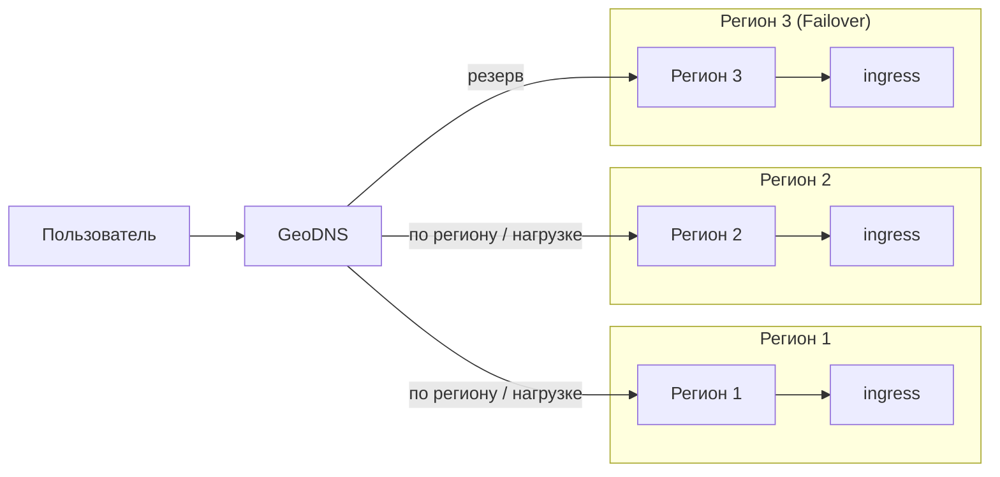
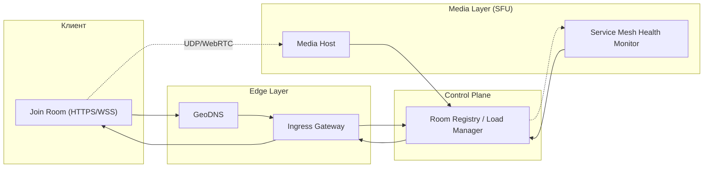

# Highload VK Education

[Задание](https://github.com/init/highload/blob/main/homework_architecture.md)

Курсовая работа по дисциплине "Проектирование высоконагруженных систем"

*Лупенков Алексей, осень 2025*

## Содержание
* [**1. Тема, аудитория, функционал**](#1-тема-аудитория-функционал)

* [**2. Расчёт нагрузки**](#2-расчёт-нагрузки)

* [**3. Глобальная балансировка нагрузки**](#3-глобальная-балансировка-нагрузки)

* [**4. Локальная балансировка нагрузки**](#4-локальная-балансировка-нагрузки)

* [**5. Логическая схема БД**](#5-логическая-схема-бд)

* [**6. Физическая схема БД**](#6-физическая-схема-бд)

## 1. Тема, аудитория, функционал

### Тема

Zoom - сервис для видеоконференций

### Аудитория

#### Мировой рынок [[1](https://www.demandsage.com/zoom-statistics/)]
* Пользователи:
  * ```700 млн. MAU```[[2](https://www.marketingscoop.com/blog/zoom-monthly-active-users-the-ultimate-guide-2024/)]
  * ```300 млн. DAU```
  * ```3.3 трлн. минут встреч в год```
  * ```45 млрд. записанных минут встреч в год```
  * ```среднее количество участников 10 человек```[[4](https://www.zoom.com/en/blog/how-you-zoomed-over-the-past-year-2021/?lang=en-US)]
  * ```Средняя продолжительность конференции 54 минуты```
  * ```Для видео формата HD пропускная способность должна быть 1.8 МБит/с на загрузку``` [[5](https://support.zoom.com/hc/ru/article?id=zm_kb&sysparm_article=KB0060759)]

#### Распределение по странам [[3](https://www.statista.com/statistics/1259936/distribution-of-zoomus-traffic-by-country/)]
* *США - ```42.06%``` пользователей*
* *Япония - ```4.26%``` пользователей*
* *Канада - ```4.14%``` пользователей*
* *Индия - ```3.86%``` пользователей*
* *Великобритания - ```3.86%``` пользователей*
* *Остальные страны - ```41.82%``` пользователей*

### Функционал

Ключевой функционал - аудио/видео связь

Ключевое продуктовое решение - запись звонка на стороне сервера, вход по ссылке

* Регистрация и авторизация
* Создание конференции
    * Аудио/видео связь
    * Запись звонка
    * Удаление/добавление участников
* Вход в конференцию по ссылке
* Текстовый чат

## 2. Расчёт нагрузки

* Допущения:
    * Размер аватарки за 400×400 пикселей в формате jpeg
    * Имя пользователя максимум может содержать 20 символов UTF-8
    * Информация о пользователе может содержать максимум 500 символов UTF-8.
    * 1 час видео в формате HD занимает примерно 1 Гб (TODO: оценить по лекциям в zoom)
    * Пользователь входит  раз в месяц
    * 1 пользователь отправляет 0.5 сообщений за конференцию
    * В 1 конференции чат содержит в среднем 150 символов
    * Пиковая нагрузка в 3 раза больше средней

### Расчет среднего размера хранилища на одного пользователя
* Фото польователя и персональная информация

$$100 + \frac{520}{1024} \approx 101 \space Кб$$

* Записи конференций

$$\frac{3.3 \cdot 10^{12}}{54 \cdot 10 \cdot 365} \approx 16742770 \space встреч \space в  \space день$$

Соотношение записанных минут встреч к незаписанным:

$$\frac{45 \cdot 10^{9}}{3.3 \cdot 10^{12}} \approx 0.0136$$

Количество записанных встреч в день:

$$16742770 \cdot 0.0136 \approx 227701 \space записанных \space встреч \space в  \space день$$

Количество записей в месяц на 1 пользователя:

$$\frac{227701}{7 \cdot 10^8} \cdot 30 \approx 0.0098$$

* Планирование конференций, информация о ссылках и т.п.

Содержит 500 символов UTF-8:

$$\frac{500}{1024} \approx 0.5 \space Кб$$

### Расчет среднего количества действий пользователя по типам в день
* Авторизация

Пусть пользователь входит  раз в месяц

* Создание конференции

$$\frac{16742770}{7 \cdot 10^{8}} \cdot 30 \approx 0.7 \space конференций \space в \space месяц$$

* Отправка сообщений в чат

Пусть 1 пользователь отправляет 0.5 сообщений за конференцию, тогда:

$$0.5 \cdot 7 \approx 4.5 \space сообщений \space в \space месяц$$

* Присоединение к конференции

$$0.7 \cdot 10 \approx 7 \space присоединений \space в \space месяц$$

* Сохранение записей

Пользователь сохраняет 0.01 встречу в месяц

### Продуктовые метрики

| Метрика                                | Значение                  |
|----------------------------------------|---------------------------|
| Месячная аудитория (MAU)               | 700 млн пользователей     |
| Дневная аудитория (DAU)                | 300 млн пользователей     |
| Профиль (аватар + данные)              | ~101 КБ                   |
| Планирование конференций               | ~0.5 КБ                   |
| Записи конференций                     | ~0.01 ГБ                  |
| Авторизация                            | 0.03/день                 |
| Создание конференций                   | 0.023/день                |
| Присоединение к конференциям           | 0.23/день                 |
| Отправка сообщений в чат               | 0.15/день                 |
| Сохранение записей                     | 0.0003/день               |

### Расчет размера хранилища данных

* Фото и персональная информация

$$\frac{101 \cdot 7 \cdot 10^8}{1024 \cdot 1024 \cdot 1024} = 67.43  \space Тб/мес$$

* Записи конференций

$$\frac{0.01 \cdot 7 \cdot 10^8}{1024\cdot 1024} = 6.68 \space Пб$$

* Планирование конференций, информация о ссылках и т.п.

$$\frac{0.5 \cdot 7 \cdot 10^8}{1024 \cdot 1024} = 333 \space Мб/мес$$

* Записи чатов

Пусть в 1 конференции чат содержит в среднем 150 символов, тогда:

$$\frac{150 \cdot 4 \cdot 7 \cdot 10^8}{1024^4} = 0.38 \space Тб$$

* Хранилище сессий

Одна сессия (sessionID, userID):
$$16 + 8 \space Б = 24 \space Б$$

$$\frac{24 \cdot 7 \cdot 10^8}{1024 \cdot 1024 \cdot 1024} = 15.65 \space Гб/мес$$

* Хранилище звонков

Один звонок (id, таймстемпы начала и конца, userIDs) байта:

$$16 + 16 + 16 + 8 \cdot 10 = 128 \space Б$$ 

$$\frac{128 \cdot 7 \cdot 10^8}{1024 \cdot 1024 \cdot 1024} = 83.45 \space Гб/мес$$ 

### Расчет сетевого трафика

* Пропускная способность видео на пользователя

$$1.8 \space Мбит/с  =  0.0018 \space Гбит/с$$ 

* Пропускная способность видео для всех пользователей

$$ \frac{16742770 \cdot 8}{86400} =  1 550.26 \space Гбит/с = 1.6 \space Тбит/с$$ 

* Передача аудио на пользователя

$$10^{-4} \space Гбит/с$$

* Передача аудио для всех пользователей

$$\frac{0.075 \cdot 16742770 \cdot 8}{86400} = 116 \space Гбит/с$$ 

* Сохранение записи в облаке для всех пользователей

$$\frac{227701 \cdot 8}{86400} =  21 \space Гбит/с$$ 

| Тип трафика                          | Базовый     | Пиковый        | Суммарно в сутки  |
|--------------------------------------|----------------------|-------------------------|-----------------------------|
| Пропускная способность видео для всех пользователей |1.6 Тбит/с| 4.8 Тбит/с| 16 Пб/сутки|
| Передача аудио для всех пользователей            |116 Гбит/с| 348 Гбит/с| 1.2 Пб/сутки|
| Сохранение записи в облаке            |21 Гбит/с|63 Гбит/с| 0,23 Пб/сутки|

### RPS 
| Действие                               | RPS в пике                | RPS                     |
|----------------------------------------|---------------------------|-------------------------|
| Авторизация                            | 405     |$$\frac{0.5 \cdot 7 \cdot 10^8}{30 \cdot 24 \cdot 3600} =  135$$ |
| Создание конференции                   | 567     |$$\frac{0.7 \cdot 7 \cdot 10^8}{30 \cdot 24 \cdot 3600} =  189$$ |
| Присоединение к конференции            | 5670     |$$\frac{7 \cdot 7 \cdot 10^8}{30 \cdot 24 \cdot 3600} =  1890$$ |
| Отправка сообщений в чат               | 405     |$$\frac{0.5 \cdot 7 \cdot 10^8}{30 \cdot 24 \cdot 3600} =  135$$ |
| Сохранение записи.                     | 9     |$$\frac{0.01 \cdot 7 \cdot 10^8}{30 \cdot 24 \cdot 3600} =  3$$ |

## 3. Глобальная балансировка нагрузки

### Функциональные группы

#### 1. управляющие 

* Обеспечивают авторизацию и аутентификацию пользователей  
* Хранят и обрабатывают метаданные (профили, настройки, расписания встреч)  
* Управляют сигналингом (установление и завершение сессий, распределение ролей — хост, ко-хост, участники) 

#### 2. медиа хосты

* Обеспечивают передачу аудио и видео в реальном времени  
* Выполняют микширование потоков (например, аудио) или форвардинг видео-потоков  
* Поддерживают механизмы адаптации качества (адаптивный битрейт, переключение разрешения)  

### Расположение датацентров

Согласно [распределению пользователей](#аудитория) по странам и карте девайсов подключенным к интернету, выберем расположение датацентров.


В США и Канаде наибольшая доля пользователей Zoom, поэтому расположим датацентры на Западном, Восточном побережьях и в центре США.

* Сан-Франциско (медиа хост)
* Нью-Йорк (медиа хост)
* Канзас-Сити (управляющий)

Европа - второй по числу пользователей регион: 

* Лондон (управляющий, медиа хост)
* Франкфурт (медиа хост)

Расположим ЦОД в Японии для покрытия юго-восточной Азии и Дальнего Востока РФ:

* Токио (управляющий, медиа хост)

Для западной Азии и Индии расположим ДЦ в этом регионе:

* Мумбаи (управляющий, медиа хост)

Сибирь и часть Азии будет обслуживать датацентр в Казахстане:
* Астана (медиа хост)

Поскольку Африка является самым непопулярным регионом, то для континента хватит одного ЦОДа на юге:

* Найроби (медиа хост)

Южную Америку будет обслуживать датацентр в Рио-де-Жанейро:

* Рио-де-Жанейро (медиа хост)

Для Австралии и Океании также будет будет достаточно одного датацентра в крупнейшем городе:

* Сидней (управляющий, медиа хост)

Также расположим дополнительный ДЦ между Азией и Австралией:

* Сингапур (медиа хост)

[Интерактивная карта](https://yandex.ru/maps/?um=constructor%3Afd74a62d0a1464f52aa56500eae09796b20fda56d0a5e416cebaf46e40ee8e8b&source=constructorLink)

| Дата-центр     | Авторизация  | Создание конференции | Сообщение в чате | Присоединение | Сохранение записи |
| -------------- | ------------ | -------------------- | ---------------- | ------------- | ----------------- |
| Сан-Франциско  | 0 / 0        | 0 / 0                | 0 / 0            | 282.0 / 883.4 | 0.46 / 1.38       |
| Нью-Йорк       | 0 / 0        | 0 / 0                | 0 / 0            | 282.0 / 883.4 | 0.46 / 1.38       |
| Канзас-Сити    | 66.6 / 199.6 | 93.6 / 279.0         | 66.6 / 199.6     | 0 / 0         | 0 / 0             |
| Лондон         | 16.7 / 50.0  | 23.3 / 70.1          | 16.7 / 50.0      | 70.7 / 221.5  | 0.12 / 0.35       |
| Франкфурт      | 0 / 0        | 0 / 0                | 0 / 0            | 255.3 / 798.5 | 0.42 / 1.24       |
| Токио          | 18.4 / 55.2  | 25.8 / 77.3          | 18.4 / 55.2      | 78.0 / 244.2  | 0.13 / 0.38       |
| Мумбаи         | 16.7 / 50.0  | 23.3 / 70.1          | 16.7 / 50.0      | 70.7 / 221.5  | 0.12 / 0.35       |
| Астана         | 0 / 0        | 0 / 0                | 0 / 0            | 255.3 / 798.5 | 0.42 / 1.24       |
| Сингапур       | 0 / 0        | 0 / 0                | 0 / 0            | 255.3 / 798.5 | 0.42 / 1.24       |
| Найроби        | 0 / 0        | 0 / 0                | 0 / 0            | 255.3 / 798.5 | 0.42 / 1.24       |
| Рио-де-Жанейро | 0 / 0        | 0 / 0                | 0 / 0            | 255.3 / 798.5 | 0.42 / 1.24       |
| Сидней         | 16.7 / 50.0  | 23.3 / 70.1          | 16.7 / 50.0      | 70.7 / 221.5  | 0.12 / 0.35       |
### Схема балансировки

Применяется DNS

#### Схема DNS-балансировки



Geo-based DNS — направляет трафик в ближайший регион.

## 4. Локальная балансировка нагрузки

Классические L4/L7-балансировщики не подойдут для stateful видео-конференций, потому что:

- отсутствует интеграция с **room-registry** — готовый LB не знает `room_id → media_host` и может разбросать участников одной комнаты по разным SFU;  
- многие медиапротоколы — **DTLS/SRTP/UDP** — требуют UDP-aware прокси с прозрачным connection tracking, чего обычные L7 LB не обеспечивают;  
- стандартные health-checks (TCP/HTTP) не отражают real-time качество (packet loss, jitter, encoder health), поэтому LB может направлять трафик на деградированные инстансы;  
- готовые LB не поддерживают гибкую политику миграции (переход комнат, graceful reconnect);  

### Схема локальной балансировки нагрузки



1. Клиент подключается к Ingress Gateway регионального дата-центра.  
2. Ingress пересылает запрос в Control Plane этого региона.  
3. Control Plane выбирает оптимальный media-host с учетом параметров загрузки, доступности и привязки комнаты (room affinity).  
4. Control Plane возвращает Ingress-узлу адрес выбранного media-host.  
5. Ingress возвращает клиенту адрес media-host.  
6. Клиент устанавливает WebRTC/UDP соединение напрямую с media-host.  
7. Media-host подтверждает соединение и регистрирует участника в реестре (room_id → media_host).

### Создание новой комнаты

1. Клиент или сервер отправляет запрос на создание комнаты в Control Plane.  
2. Control Plane выбирает media-host по текущей загрузке и политике размещения, резервирует ресурсы.  
3. Control Plane записывает соответствие `room_id → media_host` в реестр.  
4. Control Plane возвращает участникам адрес выбранного media-host и токен доступа.  
5. Участники устанавливают соединение с media-host через Ingress или Mesh.

### Присоединение к существующей комнате

1. Клиент отправляет запрос на присоединение (join) в Control Plane с `room_id`.  
2. Control Plane считывает из реестра соответствие `room_id → media_host` и возвращает адрес хоста.  
3. Клиент подключается к media-host; механизм connection tracking удерживает привязку сессии к конкретному хосту.

### Отказ и failover

1. Mesh обнаруживает, что инстанс media-host стал unhealthy.  
2. Control Plane помечает инстанс как недоступный и обновляет реестр.  
3. Для новых подключений Control Plane выбирает альтернативный media-host.  
4. Для активных комнат Control Plane инициирует миграцию — выбирает новый хост, уведомляет участников о reconnect или переводит комнату на резервный инстанс (в зависимости от реализации).  
5. Если весь регион становится недоступным, GeoDNS переключает трафик на резервный регион; клиенты повторно подключаются к новым media-host'ам.

**Формула резервирования оборудования:**

$$
N_\text{резерв} = \frac{N \times 2}{N + 1}
$$

где:

* $N$ — количество основных экземпляров;
* $N_\text{резерв}$ — количество резервных серверов/балансировщиков.

### Расчет количества балансировщиков

$$
\text{BW}_\text{балансировщика} = \text{RPS}_\text{пик} \times \text{размер запроса (ГБ)} \times 8\ (\text{Гбит/с})
$$

#### Результат ingress

Общий пиковый медиатрафик 5211 Gbit/s делим между DC пропорционально присоединениям.

*Сумма всех peak `Присоединение` = 6668 RPS.*

Для каждого DC:
1. Доля = `join_peak_DC / 6668`
2. BW_med_DC = 5211 Gbit/s * доля
3. N_baseline = ceil(BW_med_DC / 80) 
4. N_reserve = ceil((N_baseline * 2) / (N_baseline + 1))
5. N_total = N_baseline + N_reserve

| Дата-центр     | Присоединение (RPS) | baseline (N) | резерв | всего |
|----------------|----------------:|-----------------:|-----------:|---------:|
| Сан-Франциско  | 883.4           |9                | 2          | **11**   |
| Нью-Йорк       | 883.4           | 9                | 2          | **11**   |
| Канзас-Сити    | 0.0             |  0.0                   | 0                | 0          | **0**    |
| Лондон         | 221.5           |3                | 2          | **5**    |
| Франкфурт      | 798.5           |8                | 2          | **10**   |
| Токио          | 244.2           | 3                | 2          | **5**    |
| Мумбаи         | 221.5           | 3                | 2          | **5**    |
| Астана         | 798.5           | 8                | 2          | **10**   |
| Сингапур       | 798.5           |  8                | 2          | **10**   |
| Найроби        | 798.5           | 8                | 2          | **10**   |
| Рио-де-Жанейро | 798.5           |  8                | 2          | **10**   |
| Сидней         | 221.5           | 3                | 2          | **5**    |

**Итого:**  
* Baseline суммарно ≈ **70** инстансов (сумма baseline по DC)  
* С учетом резервов — суммарно ≈ **92** инстанса

#### Результат L7

$$
BW_{Gbit} = RPS_{peak} \times 10{,}240\ \text{bytes} \times 8 / 10^9 \approx RPS_{peak} \times 8.192\cdot10^{-5}$$

Один L7-инстанс (NIC 10G, U=80%) → eff = 8 Гбит/с.


| Дата-центр     | RPS            | BW (Гбит/с) | L7 baseline N | L7 резерв           | L7 итого |
|----------------|---------------:|-------------------------------:|--------------:|--------------------:|---------:|
| Сан-Франциско  | 0.00           | 0.00000                         | 0             | 0                   | 0        |
| Нью-Йорк       | 0.00           | 0.00000                         | 0             | 0                   | 0        |
| Канзас-Сити  | 678.20     | 0.05556                     | 1             | 1                   | 2    |
| Лондон     | 170.10     | 0.01393                    | 1             | 1                   | 2    |
| Франкфурт      | 0.00           | 0.00000                         | 0             | 0                   | 0        |
| Токио      | 187.70     | 0.01537                   | 1             | 1                   | 2    |
| Мумбаи     | 170.10     | 0.01393                     | 1             | 1                   | 2    |
| Астана         | 0.00           | 0.00000                         | 0             | 0                   | 0        |
| Сингапур       | 0.00           | 0.00000                         | 0             | 0                   | 0        |
| Найроби        | 0.00           | 0.00000                         | 0             | 0                   | 0        |
| Рио-де-Жанейро | 0.00           | 0.00000                         | 0             | 0                   | 0        |
| Сидней     | 170.10     | 0.01393                     | 1             | 1                   | 2    |

**Итого (L7, весь мир):** 
* 5 дата-центров × 2 = 10 L7-инстанса.

## 5. Логическая схема БД


Рассчитаем примерный необходимый объем памяти, для хранения каждой из сущностей:

| Сущность                                        |                                                                                                                                                                  Формула (байт/строку) |                     Количество (строк) |                                              Итоговый объём |
| ----------------------------------------------- | -------------------------------------------------------------------------------------------------------------------------------------------------------------------------------------: | -------------------------------------: | ----------------------------------------------------------: |
| **USERS** (metadata)                            | `16 (uuid - user_id) + 20 (text - username) + 40 (text - email) + 32 (bytea - password hash) + 8 (timestamp - created_at) + 8 (timestamp - updated_at)` = **124 байта / пользователь** |                    `700 000 000` (MAU) | **86.80 Гбайт** = `124 · 700 000 000 = 86 800 000 000 байт` |
| **MEETINGS** (metadata, в день)                 |                                                         `16 (uuid - meeting_id) + 16 (uuid - host_id) + 60 (text - meeting_url) + 8 + 8 + 8 + 8 (timestamps)` = **124 байта / строка** |                     `16 742 770 /день` |                **2.08 Гбайт / день** = `2 076 103 480 байт` |
| **PARTICIPANTS** (history, в день)              |                              `16 (uuid - participant_id) + 16 (uuid - user_id) + 16 (uuid - meeting_id) + 8 (timestamp - joined_at) + 8 (timestamp - left_at)` = **64 байта / строка** |                    `167 427 700 /день` |              **10.72 Гбайт / день** = `10 715 372 800 байт` |
| **MESSAGES** (чат, в день)                      |                                          `16 (uuid - message_id) + 16 (uuid - user_id) + 16 (uuid - meeting_id) + 150 (text - content avg) + 8 (timestamp)` = **206 байт / сообщение** |                     `83 713 850 /день` |              **17.25 Гбайт / день** = `17 245 053 100 байт` |
| **RECORDINGS (metadata, в день)**               |                                                        `16 (uuid - recording_id) + 16 (uuid - meeting_id) + 60 (text - file_url) + 8 (timestamp - created_at)` = **100 байт / строка** |                        `227 701 /день` |                  **22.77 Мбайт / день** = `22 770 100 байт` |
| **ANALYTICS** (events, в день)                  |                                                                       `16 (uuid - event_id) + 16 (uuid - meeting_id) + 20 (text - event_type) + 8 (timestamp)` = **60 байт / событие** |                     `83 713 850 /день` |                **5.02 Гбайт / день** = `5 022 831 000 байт` |
| **SESSIONS** (active, Redis)                    |                                                            `16 (uuid - user_id) + 32 (text - token) + 8 (timestamp - expires_at) + 8 (timestamp - created_at)` = **64 байта / сессия** | `600 000 000` (предположение: DAU * 2) |                     **38.40 Гбайт** = `38 400 000 000 байт` |
| **ROOM_REGISTRY** (in-memory, concurrent rooms) |   `16 (uuid - room_id) + 16 (uuid - meeting_id) + 50 (text - media_host) + 4 (int - participant_count) + 10 (text - status) + 8 (timestamp - last_heartbeat)` = **104 байта / запись** |   `~627 854` (оценка concurrent rooms) |                        **65.30 Мбайт** = `65 296 803 байта` |


### RPS / QPS
| Действие / таблица                 |                                     Avg W/s |              Peak W/s |
| ---------------------------------- | ------------------------------------------: | --------------------: |
| Создание **MEETINGS**              |    `16 742 770 / 86 400 ≈ 193.78 записей/с` |   `~581.35 записей/с` |
| Join → **PARTICIPANTS** (write)    | `167 427 700 / 86 400 ≈ 1 937.82 записей/с` | `~5 813.46 записей/с` |
| Chat → **MESSAGES** (write)        |    `83 713 850 / 86 400 ≈ 968.91 записей/с` | `~2 906.73 записей/с` |
| Запись metadata → **RECORDINGS**   |         `227 701 / 86 400 ≈ 2.64 записей/с` |     `~7.91 записей/с` |
| Analytics → **ANALYTICS** (events) |    `83 713 850 / 86 400 ≈ 968.91 записей/с` | `~2 906.73 записей/с` |


### Резюме

| Таблица / сущность                       |         Оценочный объём |
| ---------------------------------------- | ----------------------: |
| **USERS** (metadata)                     |         **86.80 Гбайт** |
| **MEETINGS** (metadata, в день)          |   **2.08 Гбайт / день** |
| **PARTICIPANTS** (rows, в день)          |  **10.72 Гбайт / день** |
| **MESSAGES** (чат, в день)               |  **17.25 Гбайт / день** |
| **RECORDINGS** (metadata, в день)        |  **22.77 Мбайт / день** |
| **ANALYTICS** (events, в день)           |   **5.02 Гбайт / день** |
| **SESSIONS** (active, Redis)             |         **38.40 Гбайт** |
| **ROOM_REGISTRY** (in-memory concurrent) |         **65.30 Мбайт** |

### Описание сущностей базы данных

| Сущность | Описание |
|-----------|-----------|
| **USERS** | Информация о пользователях сервиса. Содержит технические данные (идентификатор, email, пароль) и метаданные (username, даты создания и обновления). Используется для аутентификации, идентификации и связи с другими таблицами. |
| **MEETINGS** | Данные о встречах (видеоконференциях). Содержит информацию о ведущем (`host_id`), ссылку на встречу (`meeting_url`), время начала и окончания. Используется для планирования и управления видеовстречами. |
| **PARTICIPANTS** | Таблица участников встреч. Фиксирует, какой пользователь участвовал в какой встрече, а также время подключения (`joined_at`) и выхода (`left_at`). Нужна для аналитики, подсчёта участников и истории подключений. |
| **MESSAGES** | Сообщения, отправленные участниками во время встречи. Содержит текст (`content`), отправителя (`user_id`), встречу (`meeting_id`) и время отправки (`timestamp`). Используется для отображения чата конференции и анализа коммуникаций. |
| **RECORDINGS** | Записи видеовстреч. Хранит ссылку на файл (`file_url`), дату создания (`created_at`) и связь с конкретной встречей (`meeting_id`). Используется для хранения и последующего просмотра прошедших встреч. |
| **ANALYTICS** | Таблица аналитических событий, связанных с проведением встреч. Фиксирует тип события (`event_type`, например *join*, *leave*, *message_sent*), время (`timestamp`) и встречу (`meeting_id`). Применяется для сбора метрик и анализа активности участников. |
| **SESSIONS** | Хранит активные сессии/токены пользователей: `user_id`, `token`, `expires_at`, `created_at`. Используется для быстрой проверки авторизации (lookup по токену) и инвалидации сессий.|
| **ROOM_REGISTRY** | In-memory реестр соответствий `meeting_id, media_host` `participant_count, status, last_heartbeat`. Используется control-plane/edge для маршрутизации медиапутей (чтобы ingress возвращал адрес нужного SFU).|

| Таблица           | Консистентность |
| ----------------- | --------------- | 
| **USERS**         | **strong**      |
| **MEETINGS**      | **strong**      |
| **PARTICIPANTS**  | ?    |
| **MESSAGES**      | ?    | 
| **RECORDINGS**    | **strong**      | 
| **ANALYTICS**     | **eventual**    |
| **SESSIONS**      | **strong**      |
| **ROOM_REGISTRY** | **near-strong** |


## 6. Физическая схема БД

TODO

## Источники
1. https://www.demandsage.com/zoom-statistics/
2. https://www.marketingscoop.com/blog/zoom-monthly-active-users-the-ultimate-guide-2024/
3. https://www.statista.com/statistics/1259936/distribution-of-zoomus-traffic-by-country/
4. https://www.zoom.com/en/blog/how-you-zoomed-over-the-past-year-2021/?lang=en-US
5. https://support.zoom.com/hc/ru/article?id=zm_kb&sysparm_article=KB0060759