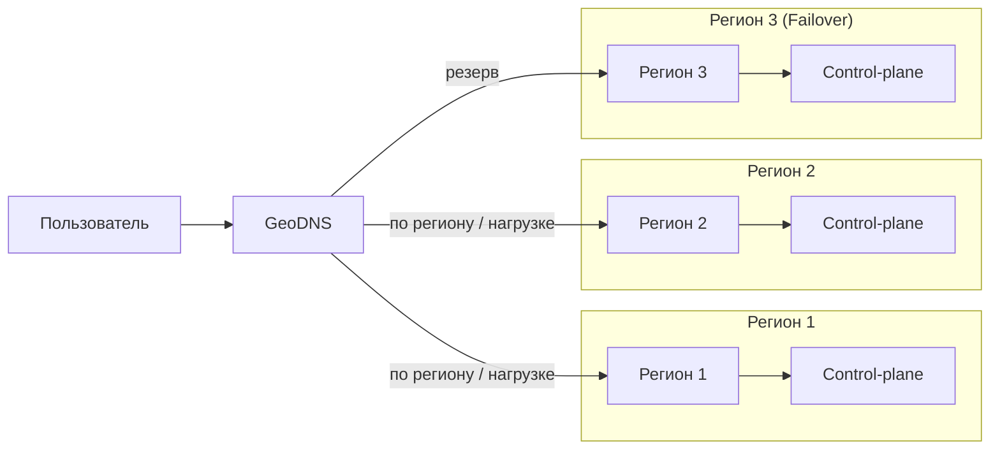
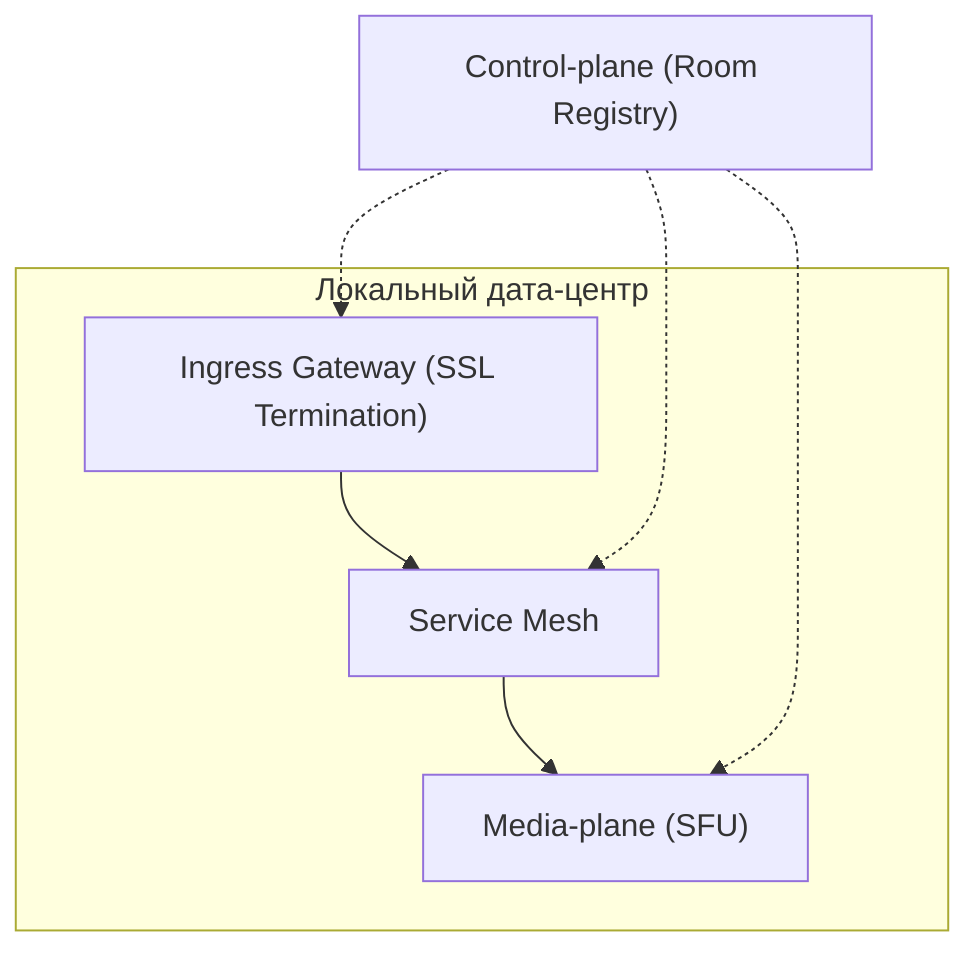
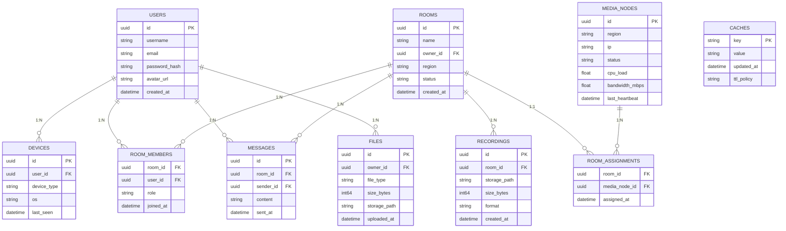

# Highload VK Education

[Задание](https://github.com/init/highload/blob/main/homework_architecture.md)

Курсовая работа по дисциплине "Проектирование высоконагруженных систем"

*Лупенков Алексей, осень 2025*


## Содержание
* [**1. Тема, аудитория, функционал**](#1-тема-аудитория-функционал)

* [**2. Расчёт нагрузки**](#2-расчёт-нагрузки)

* [**3. Глобальная балансировка нагрузки**](#3-глобальная-балансировка-нагрузки)

* [**4. Локальная балансировка нагрузки**](#4-локальная-балансировка-нагрузки)

* [**5. Логическая схема БД**](#5-логическая-схема-бд)

## 1. Тема, аудитория, функционал

### Тема

Zoom - сервис для видеоконференций

### Аудитория

#### Мировой рынок [[1](https://www.demandsage.com/zoom-statistics/)]
* Пользователи:
  * ```700 млн. MAU```[[2](https://www.marketingscoop.com/blog/zoom-monthly-active-users-the-ultimate-guide-2024/)]
  * ```300 млн. DAU```
  * ```3.3 трлн. минут встреч в год```
  * ```45 млрд. записанных минут встреч в год```
  * ```среднее количество участников 10 человек```[[4](https://www.zoom.com/en/blog/how-you-zoomed-over-the-past-year-2021/?lang=en-US)]
  * ```Средняя продолжительность конференции 54 минуты```
  * ```Для видео формата HD пропускная способность должна быть 1.8 МБит/с на загрузку``` [[5](https://support.zoom.com/hc/ru/article?id=zm_kb&sysparm_article=KB0060759)]

#### Распределение по странам [[3](https://www.statista.com/statistics/1259936/distribution-of-zoomus-traffic-by-country/)]
* *США - ```42.06%``` пользователей*
* *Япония - ```4.26%``` пользователей*
* *Канада - ```4.14%``` пользователей*
* *Индия - ```3.86%``` пользователей*
* *Великобритания - ```3.86%``` пользователей*
* *Остальные страны - ```41.82%``` пользователей*

### Функционал

Ключевой функционал - аудио/видео связь

Ключевое продуктовое решение - запись звонка на стороне сервера, вход по ссылке

* Регистрация и авторизация
* Создание конференции
    * Аудио/видео связь
    * Запись звонка
    * Удаление/добавление участников
* Вход в конференцию по ссылке
* Текстовый чат

## 2. Расчёт нагрузки

* Допущения:
    * Размер аватарки за 400×400 пикселей в формате jpeg
    * Имя пользователя максимум может содержать 20 символов UTF-8
    * Информация о пользователе может содержать максимум 500 символов UTF-8.
    * 1 час видео в формате HD занимает примерно 1 Гб (TODO: оценить по лекциям в zoom)
    * Пользователь входит  раз в месяц
    * 1 пользователь отправляет 0.5 сообщений за конференцию
    * В 1 конференции чат содержит в среднем 150 символов
    * Пиковая нагрузка в 3 раза больше средней

### Расчет среднего размера хранилища на одного пользователя
* Фото польователя и персональная информация

$$100 + \frac{520}{1024} \approx 101 \space Кб$$

* Записи конференций

$$\frac{3.3 \cdot 10^{12}}{54 \cdot 10 \cdot 365} \approx 16742770 \space встреч \space в  \space день$$

Соотношение записанных минут встреч к незаписанным:

$$\frac{45 \cdot 10^{9}}{3.3 \cdot 10^{12}} \approx 0.0136$$

Количество записанных встреч в день:

$$16742770 \cdot 0.0136 \approx 227701 \space записанных \space встреч \space в  \space день$$

Количество записей в месяц на 1 пользователя:

$$\frac{227701}{7 \cdot 10^8} \cdot 30 \approx 0.0098$$

* Планирование конференций, информация о ссылках и т.п.

Содержит 500 символов UTF-8:

$$\frac{500}{1024} \approx 0.5 \space Кб$$

### Расчет среднего количества действий пользователя по типам в день
* Авторизация

Пусть пользователь входит  раз в месяц

* Создание конференции

$$\frac{16742770}{7 \cdot 10^{8}} \cdot 30 \approx 0.7 \space конференций \space в \space месяц$$

* Отправка сообщений в чат

Пусть 1 пользователь отправляет 0.5 сообщений за конференцию, тогда:

$$0.5 \cdot 7 \approx 4.5 \space сообщений \space в \space месяц$$

* Присоединение к конференции

$$0.7 \cdot 10 \approx 7 \space присоединений \space в \space месяц$$

* Сохранение записей

Пользователь сохраняет 0.01 встречу в месяц

### Продуктовые метрики

| Метрика                                | Значение                  |
|----------------------------------------|---------------------------|
| Месячная аудитория (MAU)               | 700 млн пользователей     |
| Дневная аудитория (DAU)                | 300 млн пользователей     |
| Профиль (аватар + данные)              | ~101 КБ                   |
| Планирование конференций               | ~0.5 КБ                   |
| Записи конференций                     | ~0.01 ГБ                  |
| Авторизация                            | 0.03/день                 |
| Создание конференций                   | 0.023/день                |
| Присоединение к конференциям           | 0.23/день                 |
| Отправка сообщений в чат               | 0.15/день                 |
| Сохранение записей                     | 0.0003/день               |

### Расчет размера хранилища данных

* Фото и персональная информация

$$\frac{101 \cdot 7 \cdot 10^8}{1024 \cdot 1024 \cdot 1024} = 67.43  \space Тб/мес$$

* Записи конференций

$$\frac{0.01 \cdot 7 \cdot 10^8}{1024\cdot 1024} = 6.68 \space Пб$$

* Планирование конференций, информация о ссылках и т.п.

$$\frac{0.5 \cdot 7 \cdot 10^8}{1024 \cdot 1024} = 333 \space Мб/мес$$

* Записи чатов

Пусть в 1 конференции чат содержит в среднем 150 символов, тогда:

$$\frac{150 \cdot 4 \cdot 7 \cdot 10^8}{1024^4} = 0.38 \space Тб$$

* Хранилище сессий

Одна сессия (sessionID, userID):
$$16 + 8 \space Б = 24 \space Б$$

$$\frac{24 \cdot 7 \cdot 10^8}{1024 \cdot 1024 \cdot 1024} = 15.65 \space Гб/мес$$

* Хранилище звонков

Один звонок (id, таймстемпы начала и конца, userIDs) байта:

$$16 + 16 + 16 + 8 \cdot 10 = 128 \space Б$$ 

$$\frac{128 \cdot 7 \cdot 10^8}{1024 \cdot 1024 \cdot 1024} = 83.45 \space Гб/мес$$ 

### Расчет сетевого трафика

* Пропускная способность видео на пользователя

$$1.8 \space Мбит/с  =  0.0018 \space Гбит/с$$ 

* Пропускная способность видео для всех пользователей

$$ \frac{16742770 \cdot 8}{86400} =  1 550.26 \space Гбит/с = 1.6 \space Тбит/с$$ 

* Передача аудио на пользователя

$$10^{-4} \space Гбит/с$$

* Передача аудио для всех пользователей

$$\frac{0.075 \cdot 16742770 \cdot 8}{86400} = 116 \space Гбит/с$$ 

* Сохранение записи в облаке для всех пользователей

$$\frac{227701 \cdot 8}{86400} =  21 \space Гбит/с$$ 

| Тип трафика                          | Базовый     | Пиковый        | Суммарно в сутки  |
|--------------------------------------|----------------------|-------------------------|-----------------------------|
| Пропускная способность видео для всех пользователей |1.6 Тбит/с| 4.8 Тбит/с| 16 Пб/сутки|
| Передача аудио для всех пользователей            |116 Гбит/с| 348 Гбит/с| 1.2 Пб/сутки|
| Сохранение записи в облаке            |21 Гбит/с|63 Гбит/с| 0,23 Пб/сутки|

### RPS 
| Действие                               | RPS в пике                | RPS                     |
|----------------------------------------|---------------------------|-------------------------|
| Авторизация                            | 405     |$$\frac{0.5 \cdot 7 \cdot 10^8}{30 \cdot 24 \cdot 3600} =  135$$ |
| Создание конференции                   | 567     |$$\frac{0.7 \cdot 7 \cdot 10^8}{30 \cdot 24 \cdot 3600} =  189$$ |
| Присоединение к конференции            | 5670     |$$\frac{7 \cdot 7 \cdot 10^8}{30 \cdot 24 \cdot 3600} =  1890$$ |
| Отправка сообщений в чат               | 405     |$$\frac{0.5 \cdot 7 \cdot 10^8}{30 \cdot 24 \cdot 3600} =  135$$ |
| Сохранение записи.                     | 9     |$$\frac{0.01 \cdot 7 \cdot 10^8}{30 \cdot 24 \cdot 3600} =  3$$ |

## 3. Глобальная балансировка нагрузки

### Функциональные группы

#### 1. управляющие 

* Обеспечивают авторизацию и аутентификацию пользователей  
* Хранят и обрабатывают метаданные (профили, настройки, расписания встреч)  
* Управляют сигналингом (установление и завершение сессий, распределение ролей — хост, ко-хост, участники) 

#### 2. медиа хосты

* Обеспечивают передачу аудио и видео в реальном времени  
* Выполняют микширование потоков (например, аудио) или форвардинг видео-потоков  
* Поддерживают механизмы адаптации качества (адаптивный битрейт, переключение разрешения)  

### Расположение датацентров

Согласно [распределению пользователей](#аудитория) по странам и карте девайсов подключенным к интернету, выберем расположение датацентров.


В США и Канаде наибольшая доля пользователей Zoom, поэтому расположим датацентры на Западном, Восточном побережьях и в центре США.

* Сан-Франциско (медиа хост)
* Нью-Йорк (медиа хост)
* Канзас-Сити (управляющий)

Европа - второй по числу пользователей регион: 

* Лондон (управляющий, медиа хост)
* Франкфурт (медиа хост)

Расположим ЦОД в Японии для покрытия юго-восточной Азии и Дальнего Востока РФ:

* Токио (управляющий, медиа хост)

Для западной Азии и Индии расположим ДЦ в этом регионе:

* Мумбаи (управляющий, медиа хост)

Сибирь и часть Азии будет обслуживать датацентр в Казахстане:
* Астана (медиа хост)

Поскольку Африка является самым непопулярным регионом, то для континента хватит одного ЦОДа на юге:

* Найроби (медиа хост)

Южную Америку будет обслуживать датацентр в Рио-де-Жанейро:

* Рио-де-Жанейро (медиа хост)

Для Австралии и Океании также будет будет достаточно одного датацентра в крупнейшем городе:

* Сидней (управляющий, медиа хост)

Также расположим дополнительный ДЦ между Азией и Австралией:

* Сингапур (медиа хост)

[Интерактивная карта](https://yandex.ru/maps/?um=constructor%3Afd74a62d0a1464f52aa56500eae09796b20fda56d0a5e416cebaf46e40ee8e8b&source=constructorLink)

| Дата-центр     | Авторизация  | Создание конференции | Сообщение в чате | Присоединение | Сохранение записи |
| -------------- | ------------ | -------------------- | ---------------- | ------------- | ----------------- |
| Сан-Франциско  | 0 / 0        | 0 / 0                | 0 / 0            | 282.0 / 883.4 | 0.46 / 1.38       |
| Нью-Йорк       | 0 / 0        | 0 / 0                | 0 / 0            | 282.0 / 883.4 | 0.46 / 1.38       |
| Канзас-Сити    | 66.6 / 199.6 | 93.6 / 279.0         | 66.6 / 199.6     | 0 / 0         | 0 / 0             |
| Лондон         | 16.7 / 50.0  | 23.3 / 70.1          | 16.7 / 50.0      | 70.7 / 221.5  | 0.12 / 0.35       |
| Франкфурт      | 0 / 0        | 0 / 0                | 0 / 0            | 255.3 / 798.5 | 0.42 / 1.24       |
| Токио          | 18.4 / 55.2  | 25.8 / 77.3          | 18.4 / 55.2      | 78.0 / 244.2  | 0.13 / 0.38       |
| Мумбаи         | 16.7 / 50.0  | 23.3 / 70.1          | 16.7 / 50.0      | 70.7 / 221.5  | 0.12 / 0.35       |
| Астана         | 0 / 0        | 0 / 0                | 0 / 0            | 255.3 / 798.5 | 0.42 / 1.24       |
| Сингапур       | 0 / 0        | 0 / 0                | 0 / 0            | 255.3 / 798.5 | 0.42 / 1.24       |
| Найроби        | 0 / 0        | 0 / 0                | 0 / 0            | 255.3 / 798.5 | 0.42 / 1.24       |
| Рио-де-Жанейро | 0 / 0        | 0 / 0                | 0 / 0            | 255.3 / 798.5 | 0.42 / 1.24       |
| Сидней         | 16.7 / 50.0  | 23.3 / 70.1          | 16.7 / 50.0      | 70.7 / 221.5  | 0.12 / 0.35       |
### Схема балансировки

Применяется DNS

#### Схема DNS-балансировки



Geo-based DNS — направляет трафик в ближайший регион.

## 4. Локальная балансировка нагрузки

Классические L4/L7-балансировщики не подойдут для stateful видео-конференций, потому что:

- соединения являются **long-lived** (часами), а стандартные LB рассчитаны на короткие HTTP-запросы;  
- отсутствует интеграция с **room-registry** — готовый LB не знает `room_id → media_host` и может разбросать участников одной комнаты по разным SFU;  
- многие медиапротоколы — **DTLS/SRTP/UDP** — требуют UDP-aware прокси с прозрачным connection tracking, чего обычные L7 LB не обеспечивают;  
- стандартные health-checks (TCP/HTTP) не отражают real-time качество (packet loss, jitter, encoder health), поэтому LB может направлять трафик на деградированные инстансы;  
- готовые LB не поддерживают гибкую политику миграции/грейсфул-дрен (переход комнат, graceful reconnect) и не интегрируются с автоскейлингом по медиаметрикам;  

### Схема локальной балансировки нагрузки



1. Ingress Gateway получает от Control-plane адрес назначенного media-host.
2. Ingress инициирует маршрутизацию/проксирование через Service Mesh.
3. Cессия привязывается к выбранному media-host.
4. Клиент устанавливает media-соединение (WebRTC/UDP) с media-host.
5. Media-host подтверждает подключение, регистрирует участника в реестре комнат (`room_id → media_host`).
6. Media-host начинает принимать/пересылать аудио/видео (SFU).
7. Mesh выполняет health checks; при деградации помечает инстанс как unhealthy и исключает из LB.

### Создание новой комнаты

1. Клиент/сервер запрашивает создание комнаты у Control-plane.
2. Control-plane выбирает media-host по load/policy, резервирует ресурсы.
3. Control-plane записывает mapping `room_id → media_host` в реестр.
4. Control-plane возвращает участникам адрес media-host и токен доступа.
5. Участники подключаются к media-host через mesh/ingress.

### Присоединение к существующей комнате

1. Клиент запрашивает join у Control-plane с `room_id`.
2. Control-plane читает `room_id → media_host` и возвращает адрес.
3. Клиент подключается к media-host; connection tracking удерживает привязку.

### Отказ и failover

1. Mesh/ingress обнаруживают unhealthy.
2. Control-plane помечает инстанс как down; обновляет реестр.
3. Для новых подключений Control-plane выбирает альтернативный media-host.
4. Для активных комнат: Control-plane либо инициирует миграцию (выбор target + уведомление участников о reconnect), либо переводит работу на резервные инстансы (в зависимости от реализации).
5. Если весь регион упал — GeoDNS переключает на резервный регион; клиенты повторно подключаются к новым media-host’ам.


**Формула резервирования оборудования:**

$$
N_\text{резерв} = \frac{N \times 2}{N + 1}
$$

где:

* $N$ — количество основных экземпляров;
* $N_\text{резерв}$ — количество резервных серверов/балансировщиков.

### Расчет количества балансировщиков

$$
\text{BW}_\text{балансировщика} = \text{RPS}_\text{пик} \times \text{размер запроса (ГБ)} \times 8\ (\text{Гбит/с})
$$

#### Результат ingress

Общий пиковый медиатрафик 5211 Gbit/s делим между DC пропорционально присоединениям.

*Сумма всех peak `Присоединение` = 6668 RPS.*

Для каждого DC:
1. Доля = `join_peak_DC / 6668`
2. BW_med_DC = 5211 Gbit/s * доля
3. N_baseline = ceil(BW_med_DC / 80) 
4. N_reserve = ceil((N_baseline * 2) / (N_baseline + 1))
5. N_total = N_baseline + N_reserve

| Дата-центр     | Присоединение (RPS) | baseline (N) | резерв | всего |
|----------------|----------------:|-----------------:|-----------:|---------:|
| Сан-Франциско  | 883.4           |9                | 2          | **11**   |
| Нью-Йорк       | 883.4           | 9                | 2          | **11**   |
| Канзас-Сити    | 0.0             |  0.0                   | 0                | 0          | **0**    |
| Лондон         | 221.5           |3                | 2          | **5**    |
| Франкфурт      | 798.5           |8                | 2          | **10**   |
| Токио          | 244.2           | 3                | 2          | **5**    |
| Мумбаи         | 221.5           | 3                | 2          | **5**    |
| Астана         | 798.5           | 8                | 2          | **10**   |
| Сингапур       | 798.5           |  8                | 2          | **10**   |
| Найроби        | 798.5           | 8                | 2          | **10**   |
| Рио-де-Жанейро | 798.5           |  8                | 2          | **10**   |
| Сидней         | 221.5           | 3                | 2          | **5**    |

**Итого:**  
* Baseline суммарно ≈ **70** инстансов (сумма baseline по DC)  
* С учетом резервов — суммарно ≈ **92** инстанса

#### Результат L7

$$
BW_{sig\_Gbit} = RPS_{peak} \times 10{,}240\ \text{bytes} \times 8 / 10^9 \approx RPS_{peak} \times 8.192\cdot10^{-5}
$$

Один L7-инстанс (NIC 10G, U=80%) → eff = 8 Гбит/с.


| Дата-центр     | RPS            | BW (Гбит/с) | L7 baseline N | L7 резерв           | L7 итого |
|----------------|---------------:|-------------------------------:|--------------:|--------------------:|---------:|
| Сан-Франциско  | 0.00           | 0.00000                         | 0             | 0                   | 0        |
| Нью-Йорк       | 0.00           | 0.00000                         | 0             | 0                   | 0        |
| Канзас-Сити  | 678.20     | 0.05556                     | 1             | 1                   | 2    |
| Лондон     | 170.10     | 0.01393                    | 1             | 1                   | 2    |
| Франкфурт      | 0.00           | 0.00000                         | 0             | 0                   | 0        |
| Токио      | 187.70     | 0.01537                   | 1             | 1                   | 2    |
| Мумбаи     | 170.10     | 0.01393                     | 1             | 1                   | 2    |
| Астана         | 0.00           | 0.00000                         | 0             | 0                   | 0        |
| Сингапур       | 0.00           | 0.00000                         | 0             | 0                   | 0        |
| Найроби        | 0.00           | 0.00000                         | 0             | 0                   | 0        |
| Рио-де-Жанейро | 0.00           | 0.00000                         | 0             | 0                   | 0        |
| Сидней     | 170.10     | 0.01393                     | 1             | 1                   | 2    |

**Итого (L7, весь мир):** 
* 5 дата-центров × 2 = 10 L7-инстанса.

## 5. Логическая схема БД




## Источники
1. https://www.demandsage.com/zoom-statistics/
2. https://www.marketingscoop.com/blog/zoom-monthly-active-users-the-ultimate-guide-2024/
3. https://www.statista.com/statistics/1259936/distribution-of-zoomus-traffic-by-country/
4. https://www.zoom.com/en/blog/how-you-zoomed-over-the-past-year-2021/?lang=en-US
5. https://support.zoom.com/hc/ru/article?id=zm_kb&sysparm_article=KB0060759