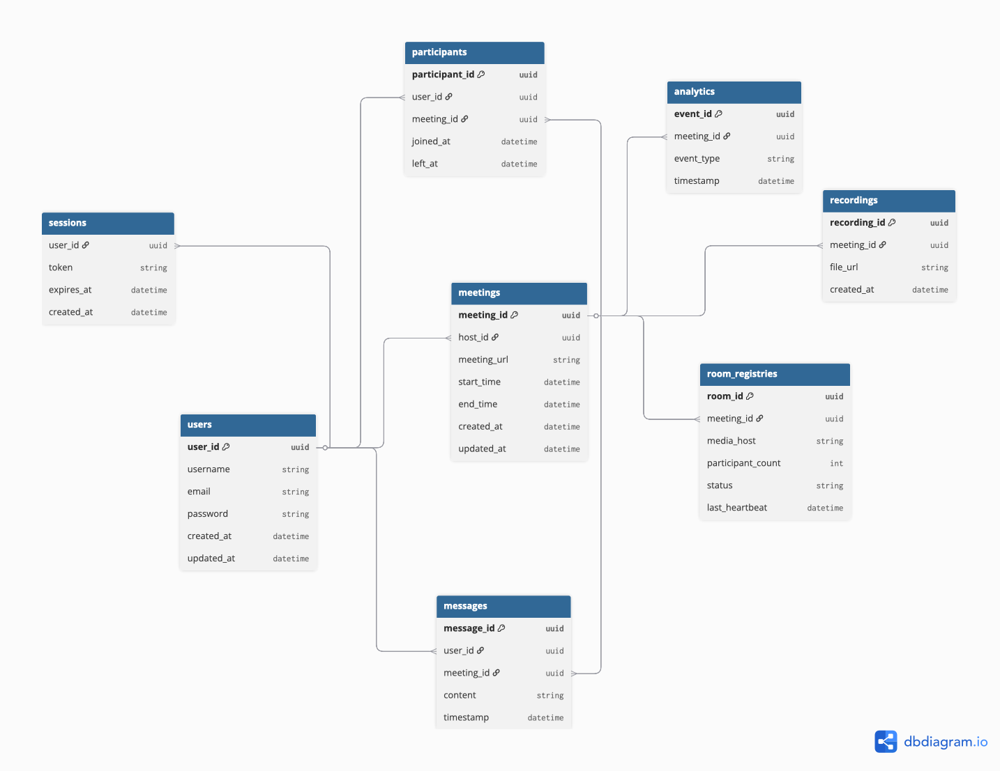

# Highload VK Education

[Задание](https://github.com/init/highload/blob/main/homework_architecture.md)

Курсовая работа по дисциплине "Проектирование высоконагруженных систем"

*Лупенков Алексей, осень 2025*

## Содержание
* [**1. Тема, аудитория, функционал**](#1-тема-аудитория-функционал)

* [**2. Расчёт нагрузки**](#2-расчёт-нагрузки)

* [**3. Глобальная балансировка нагрузки**](#3-глобальная-балансировка-нагрузки)

* [**4. Локальная балансировка нагрузки**](#4-локальная-балансировка-нагрузки)

* [**5. Логическая схема БД**](#5-логическая-схема-бд)

* [**6. Физическая схема БД**](#6-физическая-схема-бд)

* [**7. Алгоритмы**](#7-алгоритмы)

* [**8. Технологии**](#8-технологии)

* [**9. Обеспечение надежности**](#9-обеспечение-надежности)

* [**10. Схема проекта**](#10-схема-проекта)

* [**11. Расчёт ресурсов**](#11-расчёт-ресурсов)

## 1. Тема, аудитория, функционал

### Тема

Zoom - сервис для видеоконференций

### Аудитория

#### Мировой рынок [[1](https://www.demandsage.com/zoom-statistics/)]
* Пользователи:
  * ```700 млн. MAU```[[2](https://www.marketingscoop.com/blog/zoom-monthly-active-users-the-ultimate-guide-2024/)]
  * ```300 млн. DAU```
  * ```3.3 трлн. минут встреч в год```
  * ```45 млрд. записанных минут встреч в год```
  * ```среднее количество участников 10 человек```[[4](https://www.zoom.com/en/blog/how-you-zoomed-over-the-past-year-2021/?lang=en-US)]
  * ```Средняя продолжительность конференции 54 минуты```
  * ```Для видео формата HD пропускная способность должна быть 1.8 МБит/с на загрузку``` [[5](https://support.zoom.com/hc/ru/article?id=zm_kb&sysparm_article=KB0060759)]

#### Распределение по странам [[3](https://www.statista.com/statistics/1259936/distribution-of-zoomus-traffic-by-country/)]
* *США - ```42.06%``` пользователей*
* *Япония - ```4.26%``` пользователей*
* *Канада - ```4.14%``` пользователей*
* *Индия - ```3.86%``` пользователей*
* *Великобритания - ```3.86%``` пользователей*
* *Остальные страны - ```41.82%``` пользователей*

### Функционал

Ключевой функционал - аудио/видео связь

Ключевое продуктовое решение - запись звонка на стороне сервера, вход по ссылке

* Регистрация и авторизация
* Создание конференции
    * Аудио/видео связь
    * Запись звонка
    * Удаление/добавление участников
* Вход в конференцию по ссылке
* Текстовый чат

## 2. Расчёт нагрузки

* Допущения:
    * Размер аватарки за 400×400 пикселей в формате jpeg
    * Имя пользователя максимум может содержать 20 символов UTF-8
    * Информация о пользователе может содержать максимум 500 символов UTF-8.
    * 1 час видео в формате HD занимает примерно 1 Гб
    * Пользователь входит  раз в месяц
    * 1 пользователь отправляет 0.5 сообщений за конференцию
    * В 1 конференции чат содержит в среднем 150 символов
    * Пиковая нагрузка в 3 раза больше средней

### Расчет среднего размера хранилища на одного пользователя
* Фото польователя и персональная информация

$$100 + \frac{520}{1024} \approx 101 \space Кб$$

* Записи конференций

$$\frac{3.3 \cdot 10^{12}}{54 \cdot 10 \cdot 365} \approx 16742770 \space встреч \space в  \space день$$

Соотношение записанных минут встреч к незаписанным:

$$\frac{45 \cdot 10^{9}}{3.3 \cdot 10^{12}} \approx 0.0136$$

Количество записанных встреч в день:

$$16742770 \cdot 0.0136 \approx 227701 \space записанных \space встреч \space в  \space день$$

Количество записей в месяц на 1 пользователя:

$$\frac{227701}{7 \cdot 10^8} \cdot 30 \approx 0.0098$$

* Планирование конференций, информация о ссылках и т.п.

Содержит 500 символов UTF-8:

$$\frac{500}{1024} \approx 0.5 \space Кб$$

### Расчет среднего количества действий пользователя по типам в день
* Авторизация

Пусть пользователь входит  раз в месяц

* Создание конференции

$$\frac{16742770}{7 \cdot 10^{8}} \cdot 30 \approx 0.7 \space конференций \space в \space месяц$$

* Отправка сообщений в чат

Пусть 1 пользователь отправляет 0.5 сообщений за конференцию, тогда:

$$0.5 \cdot 7 \approx 4.5 \space сообщений \space в \space месяц$$

* Присоединение к конференции

$$0.7 \cdot 10 \approx 7 \space присоединений \space в \space месяц$$

* Сохранение записей

Пользователь сохраняет 0.01 встречу в месяц

### Продуктовые метрики

| Метрика                                | Значение                  |
|----------------------------------------|---------------------------|
| Месячная аудитория (MAU)               | 700 млн пользователей     |
| Дневная аудитория (DAU)                | 300 млн пользователей     |
| Профиль (аватар + данные)              | ~101 КБ                   |
| Планирование конференций               | ~0.5 КБ                   |
| Записи конференций                     | ~0.01 ГБ                  |
| Авторизация                            | 0.03/день                 |
| Создание конференций                   | 0.023/день                |
| Присоединение к конференциям           | 0.23/день                 |
| Отправка сообщений в чат               | 0.15/день                 |
| Сохранение записей                     | 0.0003/день               |

### Расчет размера хранилища данных

* Фото и персональная информация

$$\frac{101 \cdot 7 \cdot 10^8}{1024 \cdot 1024 \cdot 1024} = 67.43  \space Тб/мес$$

* Записи конференций

$$\frac{0.01 \cdot 7 \cdot 10^8}{1024\cdot 1024} = 6.68 \space Пб$$

* Планирование конференций, информация о ссылках и т.п.

$$\frac{0.5 \cdot 7 \cdot 10^8}{1024 \cdot 1024} = 333 \space Мб/мес$$

* Записи чатов

Пусть в 1 конференции чат содержит в среднем 150 символов, тогда:

$$\frac{150 \cdot 4 \cdot 7 \cdot 10^8}{1024^4} = 0.38 \space Тб$$

* Хранилище сессий

Одна сессия (sessionID, userID):
$$16 + 8 \space Б = 24 \space Б$$

$$\frac{24 \cdot 7 \cdot 10^8}{1024 \cdot 1024 \cdot 1024} = 15.65 \space Гб/мес$$

* Хранилище звонков

Один звонок (id, таймстемпы начала и конца, userIDs) байта:

$$16 + 16 + 16 + 8 \cdot 10 = 128 \space Б$$ 

$$\frac{128 \cdot 7 \cdot 10^8}{1024 \cdot 1024 \cdot 1024} = 83.45 \space Гб/мес$$ 

### Расчет сетевого трафика

* Пропускная способность видео на пользователя

$$1.8 \space Мбит/с  =  0.0018 \space Гбит/с$$ 

* Пропускная способность видео для всех пользователей

$$ \frac{16742770 \cdot 8}{86400} =  1 550.26 \space Гбит/с = 1.6 \space Тбит/с$$ 

* Передача аудио на пользователя

$$10^{-4} \space Гбит/с$$

* Передача аудио для всех пользователей

$$\frac{0.075 \cdot 16742770 \cdot 8}{86400} = 116 \space Гбит/с$$ 

* Сохранение записи в облаке для всех пользователей

$$\frac{227701 \cdot 8}{86400} =  21 \space Гбит/с$$ 

| Тип трафика                          | Базовый     | Пиковый        | Суммарно в сутки  |
|--------------------------------------|----------------------|-------------------------|-----------------------------|
| Пропускная способность видео для всех пользователей |1.6 Тбит/с| 4.8 Тбит/с| 16 Пб/сутки|
| Передача аудио для всех пользователей            |116 Гбит/с| 348 Гбит/с| 1.2 Пб/сутки|
| Сохранение записи в облаке            |21 Гбит/с|63 Гбит/с| 0,23 Пб/сутки|

### RPS 
| Действие                               | RPS в пике                | RPS                     |
|----------------------------------------|---------------------------|-------------------------|
| Авторизация                            | 405     |$$\frac{0.5 \cdot 7 \cdot 10^8}{30 \cdot 24 \cdot 3600} =  135$$ |
| Создание конференции                   | 567     |$$\frac{0.7 \cdot 7 \cdot 10^8}{30 \cdot 24 \cdot 3600} =  189$$ |
| Присоединение к конференции            | 5670     |$$\frac{7 \cdot 7 \cdot 10^8}{30 \cdot 24 \cdot 3600} =  1890$$ |
| Отправка сообщений в чат               | 405     |$$\frac{0.5 \cdot 7 \cdot 10^8}{30 \cdot 24 \cdot 3600} =  135$$ |
| Сохранение записи.                     | 9     |$$\frac{0.01 \cdot 7 \cdot 10^8}{30 \cdot 24 \cdot 3600} =  3$$ |

## 3. Глобальная балансировка нагрузки

### Функциональные группы

#### 1. управляющие 

* Обеспечивают авторизацию и аутентификацию пользователей  
* Хранят и обрабатывают метаданные (профили, настройки, расписания встреч)  
* Управляют сигналингом (установление и завершение сессий, распределение ролей — хост, ко-хост, участники) 

#### 2. медиа хосты

* Обеспечивают передачу аудио и видео в реальном времени  
* Выполняют микширование потоков (например, аудио) или форвардинг видео-потоков  
* Поддерживают механизмы адаптации качества (адаптивный битрейт, переключение разрешения)  

### Расположение датацентров

Согласно [распределению пользователей](#аудитория) по странам и карте девайсов подключенным к интернету, выберем расположение датацентров.


В США и Канаде наибольшая доля пользователей Zoom, поэтому расположим датацентры на Западном, Восточном побережьях и в центре США.

* Сан-Франциско (медиа хост)
* Нью-Йорк (медиа хост)
* Канзас-Сити (управляющий)

Европа - второй по числу пользователей регион: 

* Лондон (управляющий, медиа хост)
* Франкфурт (медиа хост)

Расположим ЦОД в Японии для покрытия юго-восточной Азии и Дальнего Востока РФ:

* Токио (управляющий, медиа хост)

Для западной Азии и Индии расположим ДЦ в этом регионе:

* Мумбаи (управляющий, медиа хост)

Сибирь и часть Азии будет обслуживать датацентр в Казахстане:
* Астана (медиа хост)

Поскольку Африка является самым непопулярным регионом, то для континента хватит одного ЦОДа на юге:

* Найроби (медиа хост)

Южную Америку будет обслуживать датацентр в Рио-де-Жанейро:

* Рио-де-Жанейро (медиа хост)

Для Австралии и Океании также будет будет достаточно одного датацентра в крупнейшем городе:

* Сидней (управляющий, медиа хост)

Также расположим дополнительный ДЦ между Азией и Австралией:

* Сингапур (медиа хост)

[Интерактивная карта](https://yandex.ru/maps/?um=constructor%3Afd74a62d0a1464f52aa56500eae09796b20fda56d0a5e416cebaf46e40ee8e8b&source=constructorLink)

| Дата-центр     | Авторизация  | Создание конференции | Сообщение в чате | Присоединение | Сохранение записи |
| -------------- | ------------ | -------------------- | ---------------- | ------------- | ----------------- |
| Сан-Франциско  | 0 / 0        | 0 / 0                | 0 / 0            | 282.0 / 883.4 | 0.46 / 1.38       |
| Нью-Йорк       | 0 / 0        | 0 / 0                | 0 / 0            | 282.0 / 883.4 | 0.46 / 1.38       |
| Канзас-Сити    | 66.6 / 199.6 | 93.6 / 279.0         | 66.6 / 199.6     | 0 / 0         | 0 / 0             |
| Лондон         | 16.7 / 50.0  | 23.3 / 70.1          | 16.7 / 50.0      | 70.7 / 221.5  | 0.12 / 0.35       |
| Франкфурт      | 0 / 0        | 0 / 0                | 0 / 0            | 255.3 / 798.5 | 0.42 / 1.24       |
| Токио          | 18.4 / 55.2  | 25.8 / 77.3          | 18.4 / 55.2      | 78.0 / 244.2  | 0.13 / 0.38       |
| Мумбаи         | 16.7 / 50.0  | 23.3 / 70.1          | 16.7 / 50.0      | 70.7 / 221.5  | 0.12 / 0.35       |
| Астана         | 0 / 0        | 0 / 0                | 0 / 0            | 255.3 / 798.5 | 0.42 / 1.24       |
| Сингапур       | 0 / 0        | 0 / 0                | 0 / 0            | 255.3 / 798.5 | 0.42 / 1.24       |
| Найроби        | 0 / 0        | 0 / 0                | 0 / 0            | 255.3 / 798.5 | 0.42 / 1.24       |
| Рио-де-Жанейро | 0 / 0        | 0 / 0                | 0 / 0            | 255.3 / 798.5 | 0.42 / 1.24       |
| Сидней         | 16.7 / 50.0  | 23.3 / 70.1          | 16.7 / 50.0      | 70.7 / 221.5  | 0.12 / 0.35       |
### Схема глобальной балансировки

Применяется DNS

#### Схема DNS-балансировки


Geo-based DNS — направляет трафик в ближайший регион.

## 4. Локальная балансировка нагрузки

### Схема локальной балансировки нагрузки


### Процесс маршрутизации

#### Создание новой комнаты
1. Клиент → L7 → Meeting Service.
2. Meeting Service создаёт запись.
3. Meeting Service вызывает Control Plane:
→ “Комната создана, назначь media-host”.
4. Control Plane выбирает SFU и пишет в бд:
room_id → media_host
5. Meeting Service возвращает клиенту ссылку на подключение.
6. На клиенте комната готова для подключения.

#### Присоединение к существующей комнате
1. Клиент делает Join Room → L7 → Meeting Service.
2. Meeting Service делает запрос в Control Plane:
“Куда отправить участника room_id?”
3. Control Plane читает из Aerospike:
media_host = registry[room_id]
4. Control Plane возвращает клиенту адрес SFU + signaling endpoint + токен.
5. Дальше клиент сам устанавливает WebRTC на SFU.

#### Отказ и failover
1. Health Monitor фиксирует, что media-host недоступен.
2. Control Plane помечает SFU как down и обновляет запись room_id → new_media_host.
3. Клиент обнаруживает обрыв WebRTC/WS соединения.
4. Клиент выполняет повторный запрос Join Room → L7 → Meeting Service.
5. Meeting Service проверяет комнату и участника, запрашивает Control Plane.
6. Control Plane возвращает новый media-host + токен + ICE/TURN.
7. Клиент устанавливает новое WebRTC соединение с назначенным SFU.

**Формула резервирования оборудования:**

$$
N_\text{серверов} = N_\text{baseline} + 1
$$

## 5. Логическая схема БД



Рассчитаем примерный необходимый объем памяти, для хранения каждой из сущностей:

| Сущность                                        |                                                                                                                                                                  Формула (байт/строку) |                     Количество (строк) |                                              Итоговый объём |
| ----------------------------------------------- | -------------------------------------------------------------------------------------------------------------------------------------------------------------------------------------: | -------------------------------------: | ----------------------------------------------------------: |
| **USERS**                             | `16 (uuid - user_id) + 20 (text - username) + 40 (text - email) + 32 (bytea - password hash) + 8 (timestamp - created_at) + 8 (timestamp - updated_at)` = **124 байта / пользователь** |                    `700 000 000` (MAU) | **86.80 Гбайт** |
| **MEETINGS**                  |                                                         `16 (uuid - meeting_id) + 16 (uuid - host_id) + 60 (text - meeting_url) + 8 + 8 + 8 + 8 (timestamps)` = **124 байта / строка** |                     `16 742 770 /день` |  **3.80 ТБ**          (2.08 Гбайт / день)  |
| **PARTICIPANTS**               |                              `16 (uuid - participant_id) + 16 (uuid - user_id) + 16 (uuid - meeting_id) + 8 (timestamp - joined_at) + 8 (timestamp - left_at)` = **64 байта / строка** |                    `167 427 700 /день` |             **19.56 ТБ** (10.72 Гбайт / день) |
| **MESSAGES**                       |                                          `16 (uuid - message_id) + 16 (uuid - user_id) + 16 (uuid - meeting_id) + 150 (text - content avg) + 8 (timestamp)` = **206 байт / сообщение** |                     `83 713 850 /день` |              **31.51 ТБ**(17.25 Гбайт / день) |
| **RECORDINGS**               |                                                        `16 (uuid - recording_id) + 16 (uuid - meeting_id) + 60 (text - file_url) + 8 (timestamp - created_at)` = **100 байт / строка** |                        `227 701 /день` |                 **41.5 ГБ** (22.77 Мбайт / день) |
| **ANALYTICS**                   |                                                                       `16 (uuid - event_id) + 16 (uuid - meeting_id) + 20 (text - event_type) + 8 (timestamp)` = **60 байт / событие** |                     `83 713 850 /день` |                **9.16 ТБ** (5.02 Гбайт / день) |
| **SESSIONS**                     |                                                            `16 (uuid - user_id) + 32 (text - token) + 8 (timestamp - expires_at) + 8 (timestamp - created_at)` = **64 байта / сессия** | `600 000 000` (предположение: DAU * 2) |                     **38.40 Гбайт** |
| **ROOM_REGISTRIES**  |   `16 (uuid - room_id) + 16 (uuid - meeting_id) + 50 (text - media_host) + 4 (int - participant_count) + 10 (text - status) + 8 (timestamp - last_heartbeat)` = **104 байта / запись** |   `~627 854` (оценка concurrent rooms) |                        **65.30 Мбайт** |

### RPS / QPS
| Таблица / Действие | Чтение (avg / peak) | Запись (avg / peak) |
| ------------------ | ------------------: | ------------------: |
| MEETINGS           |       1 938 / 5 813 |           194 / 581 |
| PARTICIPANTS       |       19 378 / 58 135 |       1 938 / 5 813 |
|        MESSAGES |      9 689 / 29 067 |         969 / 2 907 |
| RECORDINGS         |         0.26 / 0.78 |         2.64 / 7.91 |
|       ANALYTICS |            97 / 291 |         969 / 2 907 |
|        SESSIONS |      4 207 / 12 621 |           135 / 405 |
| ROOM_REGISTRIES |       1 938 / 5 813 |    1 938 / 5 813 |

### Резюме

| Таблица / сущность                       |         Оценочный объём |
| ---------------------------------------- | ----------------------: |
| **USERS**                 |         **86.80 Гбайт** |
| **MEETINGS**          |   **2.08 Гбайт / день** |
| **PARTICIPANTS**           |  **10.72 Гбайт / день** |
| **MESSAGES**             |  **17.25 Гбайт / день** |
| **RECORDINGS**       |  **22.77 Мбайт / день** |
| **ANALYTICS**           |   **5.02 Гбайт / день** |
| **SESSIONS**             |         **38.40 Гбайт** |
| **ROOM_REGISTRIES**  |         **65.30 Мбайт** |

### Описание сущностей базы данных

| Сущность | Описание |
|-----------|-----------|
| **USERS** | Информация о пользователях сервиса. Содержит технические данные (идентификатор, email, пароль) и метаданные (username, даты создания и обновления). Используется для аутентификации, идентификации и связи с другими таблицами. |
| **MEETINGS** | Данные о встречах (видеоконференциях). Содержит информацию о ведущем (`host_id`), ссылку на встречу (`meeting_url`), время начала и окончания. Используется для планирования и управления видеовстречами. |
| **PARTICIPANTS** | Таблица участников встреч. Фиксирует, какой пользователь участвовал в какой встрече, а также время подключения (`joined_at`) и выхода (`left_at`). Нужна для аналитики, подсчёта участников и истории подключений. |
| **MESSAGES** | Сообщения, отправленные участниками во время встречи. Содержит текст (`content`), отправителя (`user_id`), встречу (`meeting_id`) и время отправки (`timestamp`). Используется для отображения чата конференции и анализа коммуникаций. |
| **RECORDINGS** | Записи видеовстреч. Хранит ссылку на файл (`file_url`), дату создания (`created_at`) и связь с конкретной встречей (`meeting_id`). Используется для хранения и последующего просмотра прошедших встреч. |
| **ANALYTICS** | Таблица аналитических событий, связанных с проведением встреч. Фиксирует тип события (`event_type`, например *join*, *leave*, *message_sent*), время (`timestamp`) и встречу (`meeting_id`). Применяется для сбора метрик и анализа активности участников. |
| **SESSIONS** | Хранит активные сессии/токены пользователей: `user_id`, `token`, `expires_at`, `created_at`. Используется для быстрой проверки авторизации (lookup по токену) и инвалидации сессий.|
| **ROOM_REGISTRY** | In-memory реестр соответствий `meeting_id, media_host` `participant_count, status, last_heartbeat`. Используется control-plane для маршрутизации медиапуте|

| Таблица           | Консистентность |
| ----------------- | --------------- | 
| **USERS**         | **strong**      |
| **MEETINGS**      | **strong**      |
| **PARTICIPANTS**  | **eventual**    |
| **MESSAGES**      | **eventual**    | 
| **RECORDINGS**    | **eventual**    | 
| **ANALYTICS**     | **eventual**    |
| **SESSIONS**      | **strong**      |
| **ROOM_REGISTRIES** | **eventual**      |


## 6. Физическая схема БД


| Сущность            | Хранилище                   | Обоснование выбора                                                                                                                                                         |
| ------------------- | --------------------------- | -------------------------------------------------------------------------------------------------------------------------------------------------------------------------- |
| **USERS**           | PostgreSQL                  | Требуется строгая согласованность, транзакции и поддержка внешних ключей. Основная нагрузка — чтение профилей.              |
| **MEETINGS**        | PostgreSQL                  | Данные встреч требуют strong consistency. Диапазонное шардирование по дате позволяет архивировать старые встречи.                  |
| **RECORDINGS** | Aerospike | Метаданные о записях (ссылка на файл, идентификатор встречи) не требуют мгновенной строгой согласованности, поэтому используется eventual consistency для ускорения доступа. Основные файлы хранятся в объектном хранилище (S3).  |
| **PARTICIPANTS**    | Aerospike                   | Тысячи записей в секунду требуют низкой задержки и масштабируемости. Aerospike обеспечивает горизонтальное масштабирование и высокую доступность. |
| **MESSAGES**        | Aerospike                   | Высокая скорость вставок и чтений, масштабируемость по chat_id.                                              |
| **ANALYTICS**       | Kafka → ClickHouse | Kafka обеспечивает доставку событий, ClickHouse — быстрые запросы для дашбордов и KPI.  |
| **SESSIONS**        | Aerospike                      | Высокопроизводительное распределённое хранилище с поддержкой TTL, обеспечивающее быструю выдачу и автоматическое удаление сессий.                                    |
| **ROOM_REGISTRIES** | Aerospike                        | Контролируемый реестр для маршрутизации медиапотоков.                                          |

### Индексирование

- **PostgreSQL (USERS, MEETINGS, RECORDINGS)**
  - Primary key (по умолчанию).
  - Частые фильтры/поиски:
    - `email` (UNIQUE).
  - Составные индексы:
    - `(meeting_id, created_at)` для быстрых выборок событий по встрече и времени.

- **Aerospike (MESSAGES, PARTICIPANTS, RECORDINGS)**
  - Primary key (по умолчанию).
  - Secondary index (SI) для поиска по `timestamp`,`meeting_id`.

### Шардирование

- **PostgreSQL Citus data**
  - Вертикальное разделение: критичные транзакционные таблицы в PG.
  - Горизонтальное (при необходимости): `user_id` / `meeting_id` — хэширование.

- **ClickHouse**
  - Партиции по `event_date`, распределение по `meeting_id` (shard key) через `Distributed` таблицы.


### Реплицирование

- **PostgreSQL**
  - Primary → replica (streaming replication).

- **ClickHouse**
  - `ReplicatedMergeTree` — репликация на уровне партиций/таблиц. Click keeper. 3 ноды

- **Kafka**
  - Репликация партиций между брокерами; `replication.factor = 3`


### Схема резервного копирования

- **PostgreSQL**
  - Полные бэкапы: `pg_basebackup` (ежедневно).
  - WAL-архивирование для PITR (Point-In-Time Recovery) — хранение WAL в S3.
  - Retention: ежедневные full (14d), инкрементальные + WAL (7–30d), ежемесячные cold snapshots.
  - Регулярные тестовые восстановления (smoke restore).

- **Aerospike**
  - Periodic snapshots (cold backup) + экспорт namespace в S3; обеспечивать согласованные снимки всех нод.
  - План восстановления: spin-up new cluster, restore snapshots, wait for cluster re-balance.

- **ClickHouse**
  - Backup партиций в S3 (`BACKUP` / `TABLE ... TO DISK`), реплицированные реплики упрощают восстановление.

- **Kafka**
  - репликация партиций.

- **S3 / Object storage**
  - Versioning + Lifecycle rules.

### Мультиплексирование подключений

- **PostgreSQL**
  - Использовать пуллеры: **PgBouncer** (transaction pooling).

- **Kafka**
  - Producers/Consumers используют batching, compression и async send для throughput.

## 7. Алгоритмы

### Алгоритм распределения комнат по серверам

В системе используется гибридный алгоритм взвешенного Rendezvous hashing с учётом особенностей комнат (room-aware) для назначения комнат на SFU-серверы.

#### Учет реальной нагрузки

Алгоритм позволяет корректировать score на основе метрик сервера:

* текущее количество комнат и потоков  
* CPU / RAM utilization  
* медиапрофиль участников (bitrate, simulcast-слои)  
* сетевые задержки (RTT), packet loss

Коррекция производится через **penalty-коэффициенты**, временно понижающие вес перегруженных серверов.  

#### Минимизация ремаппинга

При добавлении новой ноды или выходе сервера из строя меняются назначения только небольшой части комнат, что минимизирует:

* количество переподключений клиентов  
* перераспределение медиапотоков  
* скачки нагрузки в кластере

Для большинства комнат выбор сервера остаётся прежним, если новая нода не даёт более высокий score.

#### Skeleton Rendezvous Hashing

Для достижения логарифмической сложности в крупных кластерах используется древовидная организация серверов (virtual skeleton).


**Структура кластера:**

* Листья: физические SFU-серверы  
* Внутренние узлы: виртуальные группы, агрегирующие метрики дочерних узлов  
* Сбалансированное дерево с фактором ветвления $b$  
* Глубина дерева: $h = \log_b n$, где $n$ — количество серверов

**Алгоритм выбора сервера:**

1. Начинаем с корневого узла дерева  
2. На каждом уровне вычисляем score для всех дочерних узлов:

   $$score(\text{room}, \text{child}) = H(\text{roomID}, \text{childID}) \cdot weight(\text{child})$$
   
4. Выбираем дочерний узел с максимальным score  
5. Рекурсивно повторяем шаги 2–3 до достижения листового узла (физического сервера)

**Вычислительная сложность:**  
$O(b \times \log_b n) = O(\log n)$ операций хеширования на комнату, где $b$ — фактор ветвления (обычно 2–8).

#### Агрегация весов

* **Листовой узел (физический сервер):**  

$$weight(\text{host}) = capacity - load - penalties$$

* **Внутренний узел:**  

$$weight(\text{node}) = \sum_{child \in children} weight(child)$$

#### Формальное определение алгоритма

Базовый механизм Rendezvous hashing:

$$score(\text{room}, \text{host}) = H(\text{roomID}, \text{hostID}) \cdot weight(\text{host})$$

где $H$ — детерминированная хеш-функция (например, xxHash),  
$weight(\text{host})$ — функция доступной емкости.

Комната закрепляется за хостом с максимальным score. Для отказоустойчивости выбираются $k$ лучших серверов (primary + replicas), $k \ge 2$.

#### Характеристики алгоритма

**Преимущества:**

* **Логарифмическая сложность** — масштабируется на кластеры любого размера  
* **Детерминированность** — гарантированная консистентность при одинаковом состоянии кластера  
* **Минимальный ремаппинг** — изменения затрагивают только $O(\log n)$ путей в дереве  
* **Естественная иерархия** — отражает физическую топологию (стойки, датацентры)  
* **Балансировка нагрузки** — учет весов обеспечивает равномерное распределение

**Производительность:**

* Время выбора сервера: $O(\log n)$  
* Перебалансировка при сбое: минимальная, только для затронутых ветвей  
* Память: $O(n)$ для хранения дерева состояний

**Отказоустойчивость:**

* Автоматический обход отказавших узлов через пересчет весов  
* Возможность выбора нескольких реплик через $k$ лучших путей в дереве

## 8. Технологии

| Технология / Алгоритм                      | Область применения                                                                 | Обоснование выбора                                                                                                                                 |
| ------------------------------------------ | ---------------------------------------------------------------------------------- | -------------------------------------------------------------------------------------------------------------------------------------------------- |
| **Go**                                     | Backend микросервисов                                                              | Высокая производительность, простота конкурентности (goroutines), богатая экосистема. Отлично подходит для высоконагруженных real-time сервисов.   |
|**gRPC**                    |Backend, взаимодействие микросервисов  |Эффективная реализация подхода Remote Procedure Call с возможностью использования ProtoBuf как быстрого и эффективного протокола для общения между микросервисами. Отлично интегрируется в Go-приложения                |
| **WebRTC**                                 | Видеоконференции / обмен медиаданными                                              | Низкая задержка, встроенная поддержка NAT traversal, шифрования и адаптации медиапотока. Прямая интеграция с SFU.                                  |
| **WebSocket**                              | Сигналинг, чат, управление состоянием                                              | Постоянное соединение для событий и уведомлений в реальном времени. Простая интеграция с браузерами и мобильными клиентами.                        |
| **SVC (Scalable Video Coding)**[[7](https://getstream.io/glossary/scalable-video-coding/)]            | Потоковое видео в многопользовательских комнатах                                   | Масштабирование видео по слоям (качество/разрешение), SFU может динамически адаптировать трафик под сеть клиента, экономия пропускной способности. |
| **Congestion Control (WebRTC GCC)**[[6](https://webrtchacks.com/probing-webrtc-bandwidth-probing-why-and-how-in-gcc/)]        | Управление пропускной способностью SFU                                             | Минимизация задержек и потерь. Адаптация битрейта под реальные условия сети для стабильного качества связи.                                        |
| **Opus DTX**[[8](https://getstream.io/resources/projects/webrtc/advanced/dtx/)]                               | Аудио в конференциях                                                               | Экономия трафика при тишине - рост масштабируемости при большом количестве участников.                                                             |
| **PostgreSQL**                             | Транзакционные данные (users, meetings)                                            | Strong consistency, поддержка сложных связей и индексов, шардирование по диапазонам (например, по дате встречи).                                   |
| **Aerospike**                                | Сессии и кэширование данных                                                        | In-memory модель с поддержкой TTL обеспечивает быстродействие при авторизации и валидации сессий.                                                  |
| **Aerospike**                              | Сообщения, участники комнат, реестры трассировки медиапотоков (SFU routing tables) | Сверхнизкие задержки и горизонтальное масштабирование при тысячах операций в секунду.                                                              |
| **Kafka**                                  | Поток событий сервиса                                                              | Асинхронное взаимодействие микросервисов, гарантированная доставка событий для аналитики.                                                          |
| **ClickHouse**                             | Аналитическое хранилище                                                            | Быстрый OLAP-движок для построения дашбордов и анализа качества связи / поведения пользователей в real-time.                                       |
| **Amazon S3**     | Хранение записей встреч                                                            | Надежность, репликация, горизонтальное масштабирование. Удобное API для загрузки/раздачи больших файлов.                                           |
| **Nginx**                                  | Обратный прокси, балансировщик                                                     | SSL-терминация, маршрутизация трафика, высокая конфигурируемость под наши протоколы (HTTPS/WebSocket).                                             |
| **Docker**                                 | Контейнеризация сервисов                                                           | Изоляция сервисов, единая среда запуска, готовность к оркестрации.                                                                                 |
| **Kubernetes**                             | Оркестрация микросервисов                                                          | Автомасштабирование SFU и backend-сервисов под нагрузку, self-healing, управление rollout-ами.                                                     |
| **VictoriaMetrics, Grafana** | Мониторинг и алертинг                                                              | Отслеживание задержек, качества медиапотока, загрузки SFU.                                                    |

## 9. Обеспечение надежности

Для обеспечения надёжности сервиса необходимо гарантировать устойчивость к сбоям на всех уровнях — аппаратном, сетевом, прикладном и организационном.

### Компоненты системы
| Компонент                                 | Способ                                   | Обоснование                                                                                                                                                                              |
| ----------------------------------------- | ---------------------------------------- | ---------------------------------------------------------------------------------------------------------------------------------------------------------------------------------------- |
| **Nginx**                                 | **Резервирование**                       | Необходимо поддерживать пул из нескольких балансировщиков для распределения трафика и обеспечения отказоустойчивости. При падении одной ноды — трафик перенаправляется на резервную.     |
| **API Gateway**                           | **Резервирование**                       | Точка входа в систему, поэтому критично обеспечить масштабирование и дублирование. Разделение потоков web/mobile клиентов и равномерное распределение нагрузки предотвращает перегрузку. |
| **PostgreSQL**                            | **Репликация и резервное копирование**   | Используется primary–replica схема (1 master, 4 реплики) и ежедневные бэкапы с WAL-архивами. Это повышает доступность и обеспечивает восстановление при сбоях.                           |
| **Aerospike**                             | **Репликация и backup**             | Встроенная репликация обеспечивает высокую доступность при больших объёмах сообщений и участников. Снимки (snapshots) хранятся в S3. Подходит для хранения сессий, участников и сообщений благодаря низким задержкам и eventual consistency.                                         |
| **ClickHouse**                            | **Репликация + Backup**              | Использование `ReplicatedMergeTree` и ClickKeeper. Cрез снапшотов старого состояния.                                                         |
| **Kafka**                                 | **Репликация брокеров**                  | Параметр `replication.factor=3` гарантирует сохранность событий даже при падении узлов.                                                                                                  |
| **S3 / Object Storage**                   | **Versioning**         | Включение версионирования и автоматическое хранение копий обеспечивает надёжность пользовательских записей.                                                                              |
| **Media-сервера (SFU)**             | **Резервирование и геораспределённость** | Несколько точек присутствия для обеспечения низкой задержки и отказоустойчивости. При падении SFU пользователи автоматически переподключаются к ближайшему узлу.                         |
| **Monitoring (VictoriaMetrics, Grafana)** | **Резервирование и алертинг**            | Метрики и логи реплицируются, что позволяет сохранять наблюдаемость даже при частичном отказе компонентов. используется реплецирование victoriaMetrics с failover                                                                               |


### Резервирование серверных ресурсов
* Использование Kubernetes для автоматического перезапуска и self-healing сервисов.
* Развёртывание всех компонентов в нескольких availability zones (multi-AZ).
* Серверы снабжаются резервными сетевыми интерфейсами, SSD-дисками, избыточной RAM и CPU.
* Horizontal Pod Autoscaler (HPA) увеличивает число экземпляров микросервисов при пиковых нагрузках.
* Liveness / Readiness probes — проверка состояния контейнеров и их перезапуск при сбоях.

### Логирование и сбор метрик
* Технические метрики: загрузка CPU, память, задержки API, состояние сетевых соединений.
* Продуктовые метрики: число участников, длительность встреч, качество медиапотока.
* Все логи и метрики отправляются в VictoriaMetrics, визуализируются в Grafana.

### Используемые архитектурные паттерны
| Паттерн                  | Назначение                                   | Применение                                                                                                                    |
| ------------------------ | -------------------------------------------- | ------------------------------------------------------------------------------------------------------------------------------------ |
| **Retry**                | Повтор запросов при временных сбоях          | При недоступности SFU клиент повторно подключается к резервному серверу. Число попыток ограничено для предотвращения перегрузки. |
| **Circuit Breaker**      | Предотвращение каскадных отказов             | API Gateway и backend-сервисы временно блокируют запросы к зависимым системам при превышении порога ошибок.                          |
| **Timeouts**             | Предотвращение «зависания» запросов          | При превышении лимита времени запрос направляется к реплике или резервному сервису.                                                  |
| **Graceful Shutdown**    | Корректное завершение работы сервисов        | При остановке контейнера в Kubernetes — завершение активных соединений, освобождение ресурсов.                                       |
| **Graceful Degradation** | Снижение функциональности без полного отказа | При падении Chat-сервиса видеосвязь продолжает работать; пользователи теряют лишь часть возможностей.                                |

### Безопасность и контроль доступа
* Разграничение доступа к базам и сервисам по ролям.
* Доступ к продакшен-данным только через ограниченные сервисные аккаунты.
* Аудит действий сотрудников и логирование всех операций управления.

### Надёжность дата-центров
| Компонент              | Мера обеспечения надёжности                 | Обоснование                                                                           |
| ---------------------- | ------------------------------------------- | ------------------------------------------------------------------------------------- |
| **Дата-центры**   | **Геораспределённое резервирование**        | Размещение узлов в разных регионах для защиты от аварий и катастроф.                  |
| **Электропитание**     | **Двойные линии + UPS + дизель-генераторы** | При потере внешнего питания — автоматическое переключение на резервные источники.     |
| **Системы охлаждения** | **Дублирование контуров**                   | Предотвращает перегрев и отказ оборудования при сбое охлаждения.                      |
| **Сети**               | **Резервные каналы связи и маршруты**       | Снижение риска потери связи при повреждении магистралей.                              |
| **Учения персонала**   | **Регулярные аварийные тренировки**         | Отработка сценариев отключения DC, симуляция потерь, контроль времени восстановления. |

## 10. Схема проекта

### Общая схема


*Обозначения:*


## 11. Расчёт ресурсов

### Хранилища

На основе расчетов, проведенных в [5 части работы](#5-логическая-схема-бд) относительно нагрузок на чтение и запись и необходимого объема данных в используемых хранилищах, а также [части 2](#2-расчёт-нагрузки) с расчетом используемого сетевого трафика, приведем следующую таблицу:

| Хранилище  | Объём данных | Запись RPS (peak) | Чтение RPS (peak) | Трафик      |
| ---------- | ------------ | ----------------: | ----------------: | ----------- |
| PostgreSQL | 3.80 ТБ      |               581 |             1 938 | ~16 Мбит/с  |
| Aerospike  | 51.55 ТБ     |             8 720 |            87 202 | ~421 Мбит/с |
| ClickHouse | 9.16 ТБ      |             2 907 |               291 | ~0.4 Мбит/с |
| Amazon S3  | 6.9 ПБ       |              7.91 |              0.78 | ~22 Гбит/с  |

### Сервисы

| Сервис           | RPS (peak)           | Трафик                              |
| ---------------- | -------------------- | ----------------------------------- |
| API Gateway      | 7056                 | <1 Гбит/с                          |
| User             | 7056                  | <1 Гбит/с                           |
| Meeting          | 6237                 | <1 Гбит/с                          |
| Message    | 405                  | <1 Гбит/с                           |
| Control plane    | 6642                  | <1 Гбит/с                           |
| Media host (SFU) | —      | 4.8 Тбит/с video + 348 Гбит/с audio |
| File creator     | 9                    | 61 Гбит/с                           |


### Необходимые ресурсы

#### Результат L7

Согласно тестам [[9](https://blog.nginx.org/blog/testing-the-performance-of-nginx-and-nginx-plus-web-servers)], сервер Nginx с 16 CPU способен держать $6\space 676$ HTTPS подключений в секунду (CPS). Такая же конфигурация способна обрабатывать $383\space  860$ RPS по HTTPS в случае, если на каждый запрос приходятся по 10 Кбайт данных. Таким образом, если принять, что $RPS_{APIGateway}=RPS_{Nginx}$, то нам будет достаточно одного сервера для обслуживания внешних HTTPS запросов. В [части 3](#3-глобальная-балансировка-нагрузки) были выбраны 5 управляющих дата-центра по всему миру. При равномерном распределении нагрузки на дата-центр будет приходится $\frac{7056}{5}\approx 1411$ RPS, "проходящих" через Nginx. Согласно тестам [[9](https://blog.nginx.org/blog/testing-the-performance-of-nginx-and-nginx-plus-web-servers)], сервер Nginx с 4 CPU способен держать $1\space 735$ HTTPS подключений в секунду (CPS). Таким образом, если принять, что $RPS_{APIGateway}=RPS_{Nginx}$, то нам будет достаточно одного сервера для обслуживания внешних HTTPS запросов. Каждому дата-центру будет достаточно одного экземпляра Nginx. С учетом резервирования возьмем 2.

Имеем:

|Сервис     |CPU|Network    |Количество|
|-----------|---|-----------|----------|
|Nginx      |4  |0.5 Гбайт/c|10        |
|API Gateway|4  |0.5 Гбайт/c|10        |

#### Go сервисы

Для производительности сервисов на Go положим:

* 1 ядро CPU = 500 RPS и 50 Кбайт RAM/запрос (легкая бизнес-логика - далее "Л")
* 1 ядро CPU = 100 RPS и 500 Кбайт RAM/запрос (средняя бизнес-логика - далее "С")
* 1 ядро CPU/(327 потоков) и 50 Мбайт RAM/(1000 потоков) (тяжелая бизнес-логика - далее "Т")

| Сервис           | Пиковый RPS | CPU, требуемое | RAM, ГБ | Сложность |
| ---------------- | ----------- | -------------- | ------- | --------- |
| API Gateway      | 7056        | 15             | 3.5     | Л         |
| User             | 7056        | 15             | 3.5     | Л         |
| Meeting          | 6237        | 63             | 3.1     | С         |
| Message          | 405         | 5              | 0.2     | С         |
| Control plane    | 6642        | 14             | 0.33    | Л         |
| File creator     | 9           | 1              | 0.01    | Т         |

| Сервис           | Кол-во потоков | CPU, требуемое | RAM, ГБ | Сложность |
| ---------------- | -------------- | -------------- | ------- | --------- |
| Media host (SFU) | 6 280 000      | 19200         | 314     | Т         |
| File creator | 85 630         | 86             | 4.3     | Т         |


#### Хранилища

#### PostgreSQL

Согласно расчетам, нагрузка на сервера PostgreSQL составляет:
- **Запись:** 581 RPS (пиковая)
- **Чтение:** 1 938 RPS (пиковая)
- **Общий TPS:** ≈ 2 519 TPS

Исходя из того, что одна машина с 2 CPU и 4 Гбайта RAM выдерживает около 5 000 TPS, для текущей нагрузки достаточно одного инстанса. Однако для обеспечения отказоустойчивости и будущего масштабирования возьмем конфигурацию с репликацией: 1 Master- и 2 Slave-инстанса.

#### Aerospike

- **Запись:** 8 720 RPS
- **Чтение:** 87 202 RPS  
- **Объем данных:** 51.55 ТБ

Согласно официальной документации Aerospike [[10](https://aerospike.com/blog/new-aerospike-benchmark-demonstrates-real-time-performance-at-petabyte-scale)], для такой нагрузки потребуется инстанс с 8 CPU и 64 Гбайт RAM. Для обеспечения производительности и отказоустойчивости возьмем кластер из 3 нод с дисками по 20 ТБ каждая.

#### ClickHouse

Аналитическая нагрузка:
- **Вставка из очереди:** 1 в день
- **Чтение:** 291 RPS
- **Объем данных:** 9.16 ТБ

Описанная нагрузка не является существенной для ClickHouse. Для обработки текущих объемов достаточно конфигурации с 4 CPU cores и 32 Гбайт RAM. Для обеспечения отказоустойчивости возьмем кластер из 2 нод с дисками по 12 ТБ каждая.

### Итого

Составим резюме для всех вышеприведенных расчетов в виде следующей сводной таблицы:

| Сервис                         | CPU (cores) | RAM (ГБ) | NVMe (ТБ) | Кол-во серверов |
| ------------------------------------- | ----------- | -------- | --------- | --------------- |
| **Nginx**                   | 4           | 16       | 0.5       | 10              |
| **API Gateway**                       | 4           | 16       | 0.5       | 10              |
| **User**                              | 8           | 8        | 0.5       | 15              |
| **Meeting**                           | 8           | 8       | 0.5       | 63              |
| **Message**                           | 5           | 4        | 0.5       | 5               |
| **Control Plane**                     | 11          | 4        | 0.5       | 14              |
| **File Creator**                      | 1           | 1        | 0.5       | 1               |
| **Media Host (SFU)**                  | 96          | 128      | 1         | 200             |
| **PostgreSQL**                        | 4           | 16       | 5         | 3               |
| **Aerospike**     | 8           | 64       | 20        | 33               |
| **ClickHouse**                        | 4           | 32       | 12        | 2               |

| Сервис               | Где разворачиваем |
| -------------------- | ----------------- |
| **Nginx**            | Bare Metal         |
| **API Gateway**      | Kubernetes        |
| **User**             | Kubernetes        |
| **Meeting**          | Kubernetes        |
| **Message**          | Kubernetes        |
| **Control Plane**    | Kubernetes        |
| **File Creator**     | Kubernetes        |
| **Media Host (SFU)** | Bare Metal        |
| **PostgreSQL**       | Bare Metal        |
| **Aerospike**        | Bare Metal        |
| **ClickHouse**       | Bare Metal        |
| **S3**               | Cloud             |

### Расчет цены

На hetzner [[11](https://www.hetzner.com/dedicated-rootserver/)]

На aws [[12](https://calculator.aws/#/createCalculator/S3)]

На Digital ocean [[13](https://cloud.digitalocean.com/kubernetes/clusters/new?i=3777d7)]

| Сервис               | Цена за месяц     |
| -------------------- | ----------------- |
| **Nginx**            |   $480       |
| **API Gateway**      |   $480      |
| **User**             |   $1350      |
| **Meeting**          |   $3024     |
| **Message**          |   $200      |
| **Control Plane**    |   $1344      |
| **File Creator**     |   $12      |
| **Media Host (SFU)** |   $62.2k      |
| **PostgreSQL**       |   $111      |
| **Aerospike**        |   $3102      |
| **ClickHouse**       |   $120      |
| **S3**               |  $149к           |
| **Итого**               |  $221000           |

## Источники
1. https://www.demandsage.com/zoom-statistics/
2. https://www.marketingscoop.com/blog/zoom-monthly-active-users-the-ultimate-guide-2024/
3. https://www.statista.com/statistics/1259936/distribution-of-zoomus-traffic-by-country/
4. https://www.zoom.com/en/blog/how-you-zoomed-over-the-past-year-2021/?lang=en-US
5. https://support.zoom.com/hc/ru/article?id=zm_kb&sysparm_article=KB0060759
6. https://webrtchacks.com/probing-webrtc-bandwidth-probing-why-and-how-in-gcc/
7. https://getstream.io/glossary/scalable-video-coding/
8. https://getstream.io/resources/projects/webrtc/advanced/dtx/
9. https://blog.nginx.org/blog/testing-the-performance-of-nginx-and-nginx-plus-web-servers
10. https://aerospike.com/blog/new-aerospike-benchmark-demonstrates-real-time-performance-at-petabyte-scale
11. https://www.hetzner.com/dedicated-rootserver/
12. https://calculator.aws/#/createCalculator/S3
13. https://cloud.digitalocean.com/kubernetes/clusters/new?i=3777d7